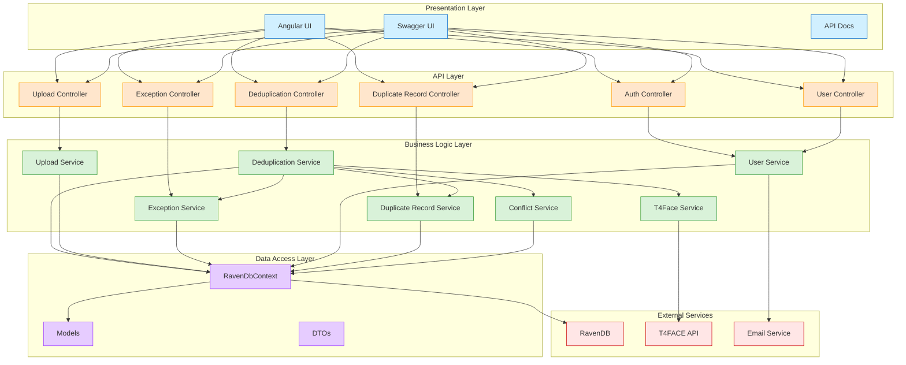
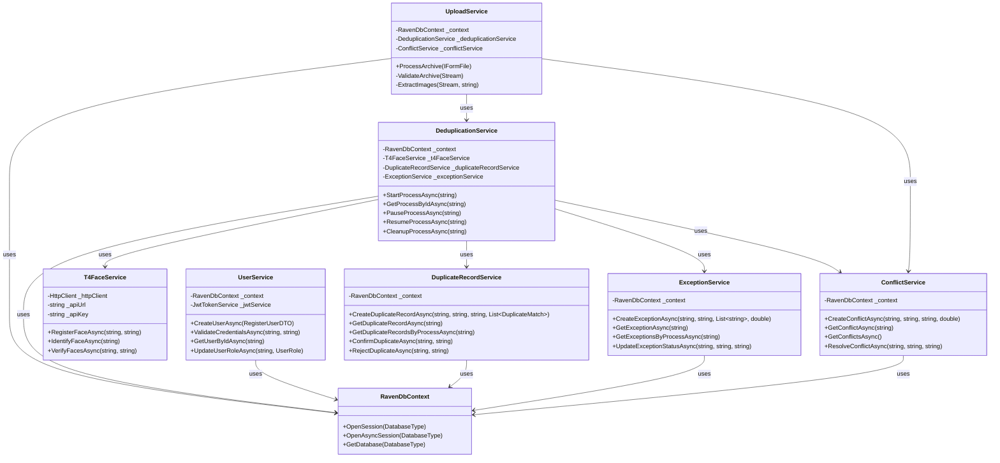

# System Architecture

This document provides a technical overview of the system architecture, focusing on the core components and their interactions.

## Architecture Overview

The system follows a layered architecture with clear separation of concerns:

## Component Diagram

## Core Components

### Controllers

Controllers handle HTTP requests and delegate business logic to services. They are responsible for:

- Request validation
- Authentication and authorization
- Response formatting
- Error handling

Key controllers:

- `AuthController`: Handles user authentication and token management
- `DeduplicationController`: Manages deduplication processes
- `DuplicateRecordController`: Handles duplicate record operations
- `ExceptionController`: Manages exception records
- `UploadingController`: Handles file uploads and processing
- `UserManagement`: Manages user accounts and roles

### Services

Services implement the core business logic of the application:

- `DeduplicationService`: Orchestrates the deduplication process

  - Creates and manages deduplication processes
  - Handles file processing and face detection
  - Integrates with T4FACE API for face recognition
  - Manages process status and lifecycle

- `T4FaceService`: Integrates with the T4FACE API

  - Registers faces from images
  - Identifies faces against existing database
  - Verifies face matches
  - Handles API errors and retries

- `DuplicateRecordService`: Manages duplicate records

  - Creates records for potential duplicates
  - Handles confirmation/rejection workflow
  - Maintains record status

- `ExceptionService`: Handles exception cases

  - Records special cases during processing
  - Provides resolution mechanisms

- `ConflictService`: Manages conflicts

  - Detects and records conflicts
  - Provides resolution strategies

- `StatusSynchronizationService`: Ensures data consistency

  - Synchronizes file statuses with process statuses
  - Fixes inconsistent data

- `UploadService`: Handles file uploads

  - Processes tar.gz archives
  - Extracts and validates images
  - Creates file records

- `UserService`: Manages user accounts
  - Handles registration and authentication
  - Manages roles and permissions
  - Handles user validation

### Data Access

The application uses RavenDB, a NoSQL document database:

- `RavenDbContext`: Provides database access

  - Manages database connections
  - Provides session management
  - Handles database operations

- Multiple databases for different entity types:
  - `users`: User accounts and profiles
  - `processes`: Deduplication processes
  - `Files`: Uploaded files and images
  - `deduplicated`: Duplicate records
  - `exceptions`: Exception records
  - `Conflicts`: Conflict records

### Models

Core domain models:

- `DeduplicationProcess`: Represents a deduplication process

  - Tracks process status and progress
  - Contains references to files
  - Records process steps and history

- `FileModel`: Represents an uploaded file

  - Stores file metadata
  - Tracks processing status
  - Contains face recognition data

- `DuplicatedRecord`: Represents a potential duplicate

  - Links original and duplicate files
  - Tracks confirmation status
  - Records user decisions

- `DeduplicationException`: Represents special cases

  - Records exception details
  - Provides resolution tracking

- `Conflict`: Represents conflicts in processing

  - Records conflict details
  - Tracks resolution status

- `UserModel`: Represents a user account
  - Stores authentication data
  - Manages roles and permissions

### DTOs (Data Transfer Objects)

DTOs facilitate data exchange between layers:

- `DeduplicationProcessDto`: Process data for API responses
- `DuplicateRecordDto`: Duplicate record data for frontend
- `ExceptionDto`: Exception data for frontend
- `ProcessDTO`: Simplified process data for listings

### Frontend Services

Angular services that interact with the backend API:

- `deduplication.service.ts`: Manages deduplication processes
- `duplicate-record.service.ts`: Handles duplicate records
- `exception.service.ts`: Manages exceptions
- `file.service.ts`: Handles file operations
- `upload.service.ts`: Manages file uploads
- `conflict.service.ts`: Handles conflicts
- `auth.service.ts`: Manages authentication
- `admin.service.ts`: Handles administrative functions

## Key Workflows

### Authentication Flow

1. User submits credentials to `AuthController`
2. `UserService` validates credentials
3. JWT token is generated and returned
4. Frontend stores token for subsequent requests

### Deduplication Process Flow

1. User uploads tar.gz file via `UploadingController`
2. `UploadService` extracts and processes images
3. `DeduplicationController` creates a process
4. `DeduplicationService` orchestrates processing:
   - Registers faces with T4FACE API
   - Identifies potential matches
   - Creates duplicate records and exceptions
5. User reviews results via frontend
6. User confirms or rejects potential duplicates
7. Optional cleanup process removes processed files

## Technical Implementation Details

### Database Structure

The system uses multiple RavenDB databases to segregate different types of data:

- **users**: Contains user accounts and authentication data
- **processes**: Stores deduplication processes and their status
- **Files**: Contains uploaded file metadata and binary data
- **deduplicated**: Stores duplicate record information
- **exceptions**: Contains exception records
- **Conflicts**: Stores conflict information

### Status Management

Processes and files have well-defined status transitions:

- Process statuses: ReadyToStart → InProcessing → Completed → Cleaning → Cleaned
- File statuses: Uploaded → Processing → Inserted → Deleted

### Error Handling

The system implements comprehensive error handling:

- Exception creation for processing errors
- Conflict detection and resolution
- Status synchronization to maintain data consistency
- Retry mechanisms for external API calls

### Security

- JWT-based authentication
- Role-based authorization (User/Admin/SuperAdmin)
- Input validation and sanitization
- Secure file handling

## Extension Points

The architecture is designed for extensibility:

- Interface-based service design (`IDeduplicationService`, `IT4FaceService`, etc.)
- Separation of concerns for easy component replacement
- Modular controller design
- Clear service boundaries

## Conclusion

The system follows a clean, layered architecture with clear separation of concerns. The business logic is encapsulated in services, with controllers handling API requests and the data layer managing persistence. This design provides maintainability, testability, and extensibility.
