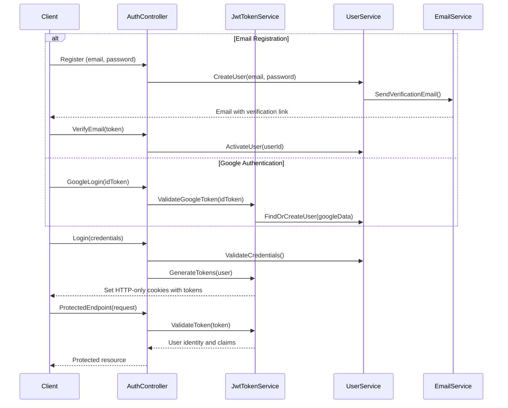

# Authentication and Authorization Documentation

## Overview

The authentication system provides secure user management with JWT token-based authentication, Google OAuth integration, and role-based authorization. It implements modern security practices for user identity verification and access control.

## Features

- **Traditional Email/Password Authentication** with BCrypt password hashing
- **Google OAuth Integration** for social login capabilities
- **JWT Token Management** with access and refresh tokens stored in HTTP-only cookies
- **Password Reset Functionality** with secure email verification
- **Role-Based Authorization** (User, Admin, SuperAdmin) with permission hierarchies

## Authentication Flow Diagram



## API Endpoints

### Registration

- **Endpoint:** `POST /api/auth/register`
- **Description:** Register a new user with email and password
- **Request Body:**
  ```json
  {
    "Username": "john_doe",
    "Email": "john@example.com",
    "Password": "Password123!",
    "ConfirmPassword": "Password123!",
    "Role": 0
  }
  ```
- **Response:** Returns authentication token and user information
  ```json
  {
    "userId": "users/1-A",
    "username": "john_doe",
    "email": "john@example.com",
    "role": 0,
    "isValidated": false,
    "token": "eyJhbGciOiJIUzI1NiIsInR5cCI6IkpXVCJ9..."
  }
  ```
- **Status Codes:**
  - 201: User created successfully
  - 400: Invalid request (validation errors)
  - 409: Email already registered

### Login

- **Endpoint:** `POST /api/auth/login`
- **Description:** Authenticate user with email and password
- **Request Body:**
  ```json
  {
    "Email": "john@example.com",
    "Password": "Password123!"
  }
  ```
- **Response:** Returns JWT token, refresh token, and expiration time
  ```json
  {
    "userId": "users/1-A",
    "username": "john_doe",
    "email": "john@example.com",
    "role": 0,
    "token": "eyJhbGciOiJIUzI1NiIsInR5cCI6IkpXVCJ9...",
    "refreshToken": "Oi77ETYuhdbr2g...",
    "expiresAt": "2023-12-01T12:00:00Z"
  }
  ```
- **Status Codes:**
  - 200: Login successful
  - 400: Invalid credentials
  - 401: Account not verified

### Google Login

- **Endpoint:** `POST /api/auth/google-login`
- **Description:** Authenticate user with Google ID token
- **Request Body:**
  ```json
  {
    "IdToken": "Google-provided-ID-token"
  }
  ```
- **Response:** Similar to standard login response
- **Status Codes:**
  - 200: Login successful
  - 400: Invalid Google token

### Forgot Password

- **Endpoint:** `POST /api/auth/forgot-password`
- **Description:** Initiate password reset procedure by sending email with reset token
- **Request Body:**
  ```json
  {
    "Email": "john@example.com"
  }
  ```
- **Response:** Confirmation that email was sent
  ```json
  {
    "message": "Password reset link sent to your email"
  }
  ```
- **Status Codes:**
  - 200: Reset email sent
  - 404: Email not found

### Reset Password

- **Endpoint:** `POST /api/auth/reset-password`
- **Description:** Complete password reset with token and new password
- **Request Body:**
  ```json
  {
    "Token": "reset-token-from-email",
    "NewPassword": "NewPassword123!",
    "ConfirmPassword": "NewPassword123!"
  }
  ```
- **Response:** Confirmation of password reset
  ```json
  {
    "message": "Password has been reset successfully"
  }
  ```
- **Status Codes:**
  - 200: Password reset successful
  - 400: Invalid or expired token, password validation failed
  - 404: User not found

### Refresh Token

- **Endpoint:** `POST /api/auth/refresh-token`
- **Description:** Get a new access token using refresh token
- **Request:** Uses HTTP-only cookie containing refresh token
- **Response:** New access token
  ```json
  {
    "token": "eyJhbGciOiJIUzI1NiIsInR5cCI6IkpXVCJ9...",
    "expiresAt": "2023-12-01T14:00:00Z"
  }
  ```
- **Status Codes:**
  - 200: Token refreshed successfully
  - 401: Invalid or expired refresh token

## Security Implementation

- JWT tokens are encrypted using HMAC SHA-256 with a secure key stored in environment variables
- Passwords are hashed using BCrypt before storage with unique salt per user
- Refresh tokens are used to obtain new access tokens without re-authentication
- Tokens are stored in HTTP-only cookies with Secure and SameSite attributes
- HTTPS is enforced for all communication
- Rate limiting on authentication endpoints to prevent brute force attacks
- CORS is configured to allow only specific origins

## Authentication Flow

1. User registers or logs in via email/password or Google OAuth
2. Server validates credentials and generates JWT token
3. Token is returned to client and stored in HTTP-only cookie
4. Client includes cookie in subsequent requests for authentication
5. Protected endpoints verify token signature and claims
6. Expired tokens can be refreshed using refresh token

## Role-Based Authorization

- **User (0)**: Standard user access
  - Can access own profile
  - Can upload files
  - Can run deduplication processes
- **Admin (1)**: Administrative capabilities
  - Can manage regular users
  - Can see process reports
  - Can manage conflicts
- **SuperAdmin (2)**: Full system access
  - Can manage all users including admins
  - Can access all system features
  - Can configure system settings

## Implementation Details

- JWT tokens expire after 2 hours (configurable)
- Refresh tokens expire after 7 days (configurable)
- Account verification is required before first login (email verification)
- Password reset tokens expire after 24 hours
- Failed login attempts are tracked with temporary lockouts
- Password complexity requirements:
  - Minimum 8 characters
  - At least one uppercase letter
  - At least one lowercase letter
  - At least one number
  - At least one special character
