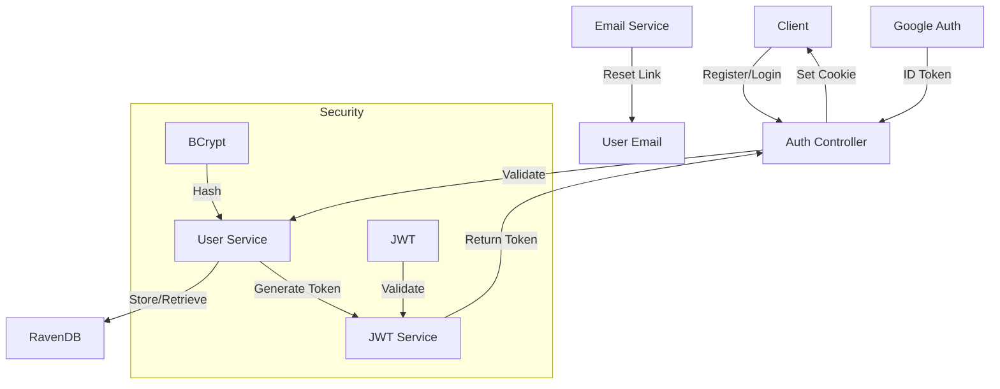

# Authentication System Documentation

## Table of Contents

1. [Authentication Endpoints](#authentication-endpoints)
2. [Authentication Flows](#authentication-flows)
3. [Security Techniques](#security-techniques)
4. [Role Management](#role-management)
5. [System Architecture](#system-architecture)

## Authentication Endpoints

### 1. Register User

- **Endpoint**: `POST /api/auth/register`
- **Request Body**:

```json
{
  "Username": "john_doe",
  "Email": "john@example.com",
  "Password": "Password123!",
  "Confirmpassword": "Password123!",
  "Role": 0
}
```

- **Responses**:
  - 201 Created: User successfully registered
  - 400 Bad Request: Email already exists or invalid data
  - 500 Internal Server Error: Server error

### 2. Login

- **Endpoint**: `POST /api/auth/login`
- **Request Body**:

```json
{
  "Email": "john@example.com",
  "Password": "Password123!"
}
```

- **Responses**:
  - 200 OK: Login successful, returns JWT token in cookie
  - 401 Unauthorized: Invalid credentials
  - 500 Internal Server Error: Server error

### 3. Google Login

- **Endpoint**: `POST /api/auth/google-login`
- **Request Body**:

```json
{
  "IdToken": "google_id_token"
}
```

- **Responses**:
  - 200 OK: Login successful, returns JWT token in cookie
  - 401 Unauthorized: Invalid Google token
  - 500 Internal Server Error: Server error

### 4. Logout

- **Endpoint**: `POST /api/auth/logout`
- **Responses**:
  - 200 OK: Successfully logged out

### 5. Forgot Password

- **Endpoint**: `POST /api/auth/forgot-password`
- **Request Body**:

```json
{
  "Email": "john@example.com"
}
```

- **Responses**:
  - 200 OK: Reset password link sent
  - 404 Not Found: Email not found
  - 500 Internal Server Error: Server error

### 6. Reset Password

- **Endpoint**: `POST /api/auth/reset-password`
- **Request Body**:

```json
{
  "Token": "reset_token",
  "NewPass": "NewPassword123!"
}
```

- **Responses**:
  - 200 OK: Password reset successful
  - 400 Bad Request: Invalid or expired token
  - 500 Internal Server Error: Server error

## Authentication Flows

### 1. Registration Flow

1. User submits registration form
2. System checks if email exists
3. Password is hashed using BCrypt
4. User is created with default role (User)
5. First user becomes SuperAdmin
6. JWT token is generated and stored in cookie

### 2. Login Flow

1. User submits credentials
2. System verifies email and password
3. JWT token is generated with claims:
   - Email
   - Role
   - UserId
4. Token is stored in secure HTTP-only cookie

### 3. Google Login Flow

1. User authenticates with Google
2. System receives Google ID token
3. Token is validated with Google
4. If user doesn't exist, account is created
5. JWT token is generated and stored in cookie

### 4. Password Reset Flow

1. User requests password reset
2. System generates reset token (valid for 15 minutes)
3. Reset link is sent via email
4. User submits new password with token
5. System validates token and updates password

## Security Techniques

### 1. Password Security

- BCrypt hashing for password storage
- Password confirmation required
- Minimum password requirements enforced

### 2. Token Security

- JWT tokens with 1-hour expiration
- Secure HTTP-only cookies
- SameSite cookie policy
- HTTPS required

### 3. Role-Based Access Control

- Three roles: User, Admin, SuperAdmin
- Role-based authorization on endpoints
- First user becomes SuperAdmin
- Only SuperAdmin can promote/demote users

## Role Management

### 1. Role Definition

```csharp
public enum UserRole
{
    User,        // 0 - Regular user with basic privileges
    Admin,       // 1 - Administrator with elevated privileges
    SuperAdmin   // 2 - Super Administrator with full system access
}
```

### 2. Role Assignment Logic

1. **First User Rule**:

   - The first user to register in the system automatically becomes a SuperAdmin
   - This ensures there's always at least one SuperAdmin in the system

   ```csharp
   bool isFirstUser = !session.Query<UserModel>().Any();
   Role = isFirstUser ? UserRole.SuperAdmin : registerUserDto.Role;
   ```

2. **Default Role**:

   - New users are assigned the User role (0) by default
   - This is set in the UserModel constructor:

   ```csharp
   public UserModel()
   {
       Role = UserRole.User;
   }
   ```

3. **Role Promotion/Demotion**:
   - Only SuperAdmin can promote users to Admin
   - Only SuperAdmin can demote Admins to Users
   - SuperAdmin accounts cannot be demoted

### 3. Role Permissions

1. **User (Role = 0)**:

   - Basic access to application features
   - Can manage their own profile
   - Can use core application functionality

2. **Admin (Role = 1)**:

   - All User permissions
   - Can manage other users
   - Access to administrative features
   - Cannot modify SuperAdmin accounts

3. **SuperAdmin (Role = 2)**:
   - All Admin permissions
   - Can promote/demote users
   - Full system configuration access
   - Cannot be demoted by other users

### 4. Role Validation

1. **Registration**:

   - Role is validated during user registration
   - Cannot directly register as SuperAdmin (except first user)
   - Invalid role requests default to User role

2. **Authentication**:

   - Role is included in JWT token claims
   - ```csharp
     new Claim(ClaimTypes.Role, user.Role.ToString())
     ```
   - Used for authorization in protected endpoints

3. **API Access**:
   - Role-based middleware checks
   - Attribute-based authorization
   - Example:
     ```csharp
     [Authorize(Roles = "Admin,SuperAdmin")]
     ```

### 5. Role Management API

1. **Promote to Admin**:

   ```http
   POST /api/users/{userId}/promote
   Authorization: Required (SuperAdmin only)
   ```

2. **Demote Admin**:

   ```http
   POST /api/users/{userId}/demote
   Authorization: Required (SuperAdmin only)
   ```

3. **Get User Role**:
   ```http
   GET /api/users/{userId}/role
   Authorization: Required (Admin or SuperAdmin)
   ```

## System Architecture



### Components

1. **Auth Controller**: Handles all authentication endpoints
2. **User Service**: Manages user operations and authentication
3. **JWT Service**: Handles token generation and validation
4. **RavenDB**: Stores user data and tokens
5. **Email Service**: Handles password reset emails

### Security Layers

1. **Transport Layer**: HTTPS encryption
2. **Authentication Layer**: JWT tokens
3. **Authorization Layer**: Role-based access control
4. **Data Layer**: Password hashing and secure storage
