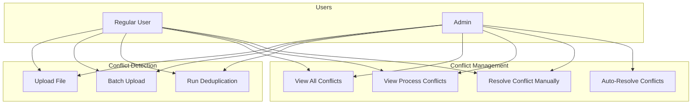
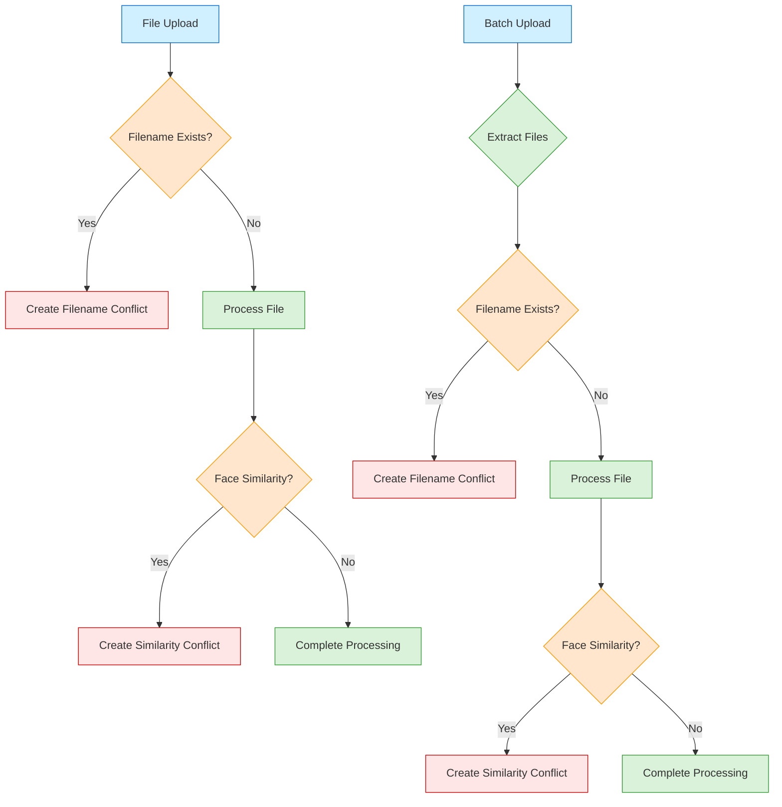
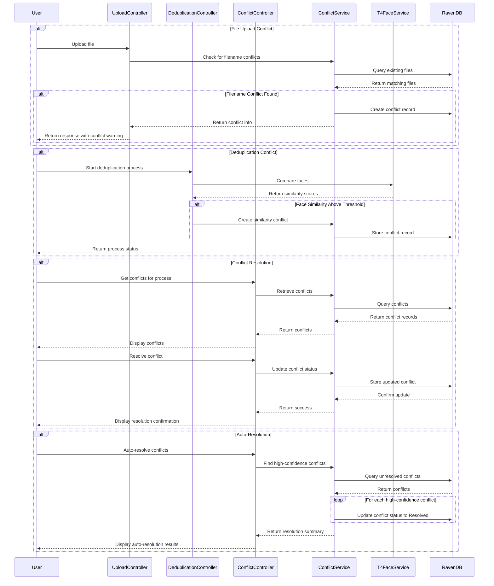
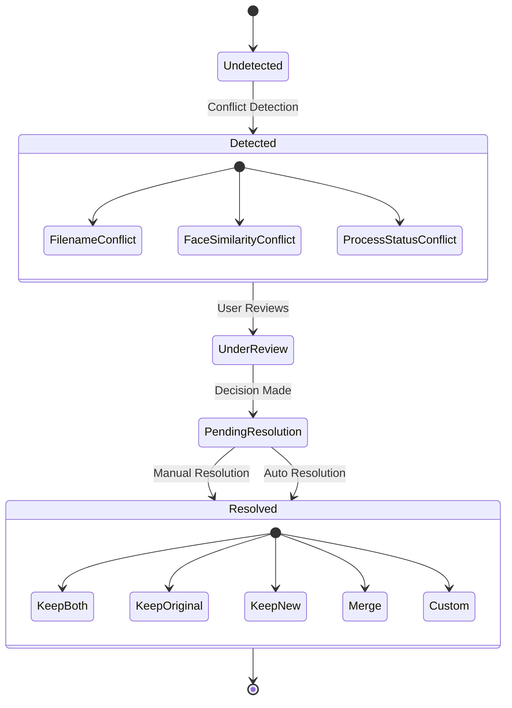
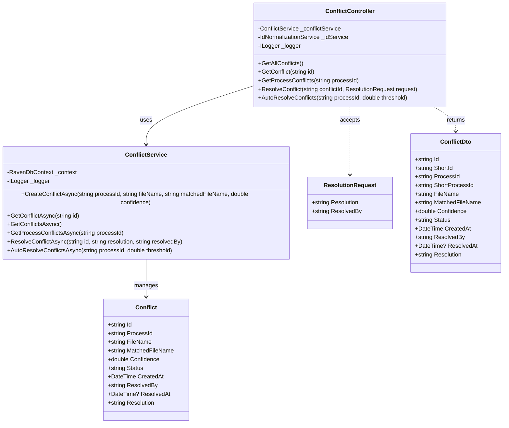

# Conflict Management Documentation

## Overview

The conflict management system identifies and handles potential conflicts during file uploads and deduplication processes. It provides a structured way to detect, review, and resolve conflicts to maintain data integrity and prevent duplicate entries.

## Use Case Diagram



## Features

- **Automatic Conflict Detection** during file uploads and deduplication
- **Multiple Conflict Types** including filename conflicts and face similarity conflicts
- **Conflict Resolution Workflow** with manual and automatic resolution options
- **Confidence-Based Auto-Resolution** for high-confidence matches
- **Detailed Conflict Records** with metadata for informed decision-making

## Conflict Detection Flow Diagram



## Sequence Diagram



## State Diagram



## Class Diagram



## Conflict Types

### 1. Filename Conflict

Occurs when a user uploads a file with a name that already exists in the system. The system creates a conflict record with 100% confidence for exact filename matches.

### 2. Face Similarity Conflict

Occurs during the deduplication process when the system detects that a face in an uploaded file is similar to an existing face in the database. The confidence level is determined by the T4FACE API's similarity score.

### 3. Process Status Conflict

Occurs when a user attempts to start a deduplication process that is already running or completed. These are handled as exceptions rather than standard conflicts.

### 4. T4FACE API Conflicts

Potential matches identified by the T4FACE API during face identification. These are recorded as duplicate records and exceptions rather than standard conflicts.

## Conflict Resolution Workflow

1. **Detection**: System automatically detects conflicts during upload or deduplication
2. **Notification**: Process status is updated to "Conflict Detected"
3. **Review**: User reviews conflicts through the conflict management endpoints
4. **Resolution**: User resolves conflicts manually or uses auto-resolution for high-confidence matches
5. **Completion**: Resolved conflicts are marked as "Resolved" with resolution details

## API Endpoints

### Get All Conflicts

- **Endpoint:** `GET /api/Conflict/all`
- **Description:** Retrieves all conflicts in the system (limited to 1000)
- **Authentication:** Required (JWT)
- **Response:** Array of conflict objects
- **Status Codes:**
  - 200: Conflicts retrieved successfully
  - 401: Unauthorized

### Get Specific Conflict

- **Endpoint:** `GET /api/Conflict/{id}`
- **Description:** Retrieves a specific conflict by ID
- **Authentication:** Required (JWT)
- **Path Parameters:**
  - id: The ID of the conflict to retrieve
- **Response:** Conflict details
  ```json
  {
    "id": "Conflicts/84d5d276-35dc-498a-b7d4-aa419c77129f",
    "processId": "processes/548245ff-3648-4301-99b8-af055e8d6e94",
    "fileName": "person1.jpg",
    "matchedFileName": "File name conflict with existing file: files/cbaa91e1-b956-493d-a81e-727926951d5b",
    "confidence": 1.0,
    "status": "Unresolved",
    "createdAt": "2025-04-28T22:17:07Z",
    "resolvedBy": null,
    "resolvedAt": null,
    "resolution": null
  }
  ```
- **Status Codes:**
  - 200: Conflict retrieved successfully
  - 401: Unauthorized
  - 404: Conflict not found

### Get Process Conflicts

- **Endpoint:** `GET /api/Conflict/process/{processId}`
- **Description:** Retrieves all conflicts for a specific process
- **Authentication:** Required (JWT)
- **Path Parameters:**
  - processId: The ID of the process to retrieve conflicts for
- **Response:** Array of conflicts
- **Status Codes:**
  - 200: Conflicts retrieved successfully
  - 400: Bad request
  - 401: Unauthorized

### Resolve Conflict

- **Endpoint:** `POST /api/Conflict/resolve/{conflictId}`
- **Description:** Resolves a specific conflict
- **Authentication:** Required (JWT)
- **Path Parameters:**
  - conflictId: The ID of the conflict to resolve
- **Request Body:**
  ```json
  {
    "resolution": "Keep both files",
    "resolvedBy": "user@example.com"
  }
  ```
- **Response:** Success message and resolved conflict
  ```json
  {
    "message": "Conflict resolved successfully",
    "conflict": {
      "id": "Conflicts/84d5d276-35dc-498a-b7d4-aa419c77129f",
      "processId": "processes/548245ff-3648-4301-99b8-af055e8d6e94",
      "fileName": "person1.jpg",
      "matchedFileName": "File name conflict with existing file: files/cbaa91e1-b956-493d-a81e-727926951d5b",
      "confidence": 1.0,
      "status": "Resolved",
      "createdAt": "2025-04-28T22:17:07Z",
      "resolvedBy": "user@example.com",
      "resolvedAt": "2025-04-29T10:30:15Z",
      "resolution": "Keep both files"
    }
  }
  ```
- **Status Codes:**
  - 200: Conflict resolved successfully
  - 400: Bad request
  - 401: Unauthorized
  - 404: Conflict not found

### Auto-Resolve Conflicts

- **Endpoint:** `GET /api/Conflict/auto-resolve/{processId}` or `POST /api/Conflict/auto-resolve/{processId}`
- **Description:** Automatically resolves high-confidence conflicts for a process
- **Authentication:** Required (JWT)
- **Path Parameters:**
  - processId: The ID of the process to auto-resolve conflicts for
- **Query Parameters:**
  - threshold: Confidence threshold for auto-resolution (default: 0.95)
- **Response:** Summary of auto-resolved conflicts
  ```json
  {
    "success": true,
    "message": "Auto-resolved 3 conflicts with confidence >= 0.95",
    "totalConflicts": 5,
    "autoResolvedCount": 3,
    "remainingConflicts": 2
  }
  ```
- **Status Codes:**
  - 200: Auto-resolution completed successfully
  - 400: Bad request
  - 401: Unauthorized
  - 404: Process not found

## Conflict Creation Scenarios

### Scenario 1: Single File Upload with Existing Filename

When a user uploads a file with a name that already exists:

1. System checks if the filename exists in the database
2. If found, a new conflict process is created with status "Conflict Detected"
3. A conflict record is created with 100% confidence
4. User receives a response indicating the conflict has been created

```csharp
// Check if file name already exists in the system
var existingFile = await CheckIfFileNameExistsAsync(file.FileName);
if (existingFile != null)
{
  // Create a new process for this conflict
  var conflictProcessId = Guid.NewGuid().ToString();
  var conflictProcess = new DeduplicationProcess
  {
    Id = $"processes/{conflictProcessId}",
    Name = $"Conflict-{DateTime.UtcNow:yyyyMMdd-HHmmss}",
    Username = User.Identity?.Name ?? "anonymous",
    Status = "Conflict Detected",
    // ...
  };

  // Create a conflict record
  var conflict = await conflictService.CreateConflictAsync(
      conflictProcess.Id,
      file.FileName,
      $"File name conflict with existing file: {existingFile.Id}",
      1.0); // 100% confidence for exact filename match
}
```

### Scenario 2: Batch Upload (tar.gz) with Existing Filenames

When a user uploads a tar.gz archive containing files with names that already exist:

1. System extracts files from the archive
2. For each file, the system checks if the filename already exists
3. If a match is found, a conflict record is created
4. The process status is updated to "Conflict Detected"

```csharp
if (fileNameMatch != null)
{
  // Create a conflict record for this specific file
  var conflictService = new ConflictService(_dbContext);
  var conflict = await conflictService.CreateConflictAsync(
      process.Id,
      fileName,
      $"File name conflict with existing file: {fileNameMatch.Id}",
      1.0); // 100% confidence for exact filename match

  hasConflict = true;
}

// Later in the code:
if (hasConflicts && process.Status != "Conflict Detected")
{
  process.Status = "Conflict Detected";
  // Save the updated process status
}
```

### Scenario 3: Face Similarity Detection During Deduplication

When the system detects that a face in an uploaded file is similar to an existing face:

1. During deduplication, the system compares faces with existing faces
2. If similarity is above a threshold (70% by default), a conflict is created
3. The conflict includes the confidence score from the face verification

```csharp
foreach (var existingFile in existingFiles.Where(f => f.Id != file.Id && f.Status == "Inserted"))
{
  // Verify faces using T4FaceService
  var verificationResult = await _t4FaceService.VerifyFaceAgainstPersonAsync(file.Base64String, existingFile.FaceId);

  if (verificationResult.IsMatch && verificationResult.Confidence > 70) // Threshold is 70%
  {
    // Create conflict record
    await _conflictService.CreateConflictAsync(
        process.Id,
        file.FileName,
        $"Conflict with {existingFile.FileName}",
        verificationResult.Confidence);

    conflicts.Add(existingFile.FileName);
  }
}
```

## Conflict Resolution Strategies

### Manual Resolution

Users can manually resolve conflicts by providing a resolution decision and their identifier:

1. User reviews the conflict details including confidence score
2. User decides how to resolve the conflict (keep, delete, merge, etc.)
3. User submits the resolution through the API
4. System updates the conflict status to "Resolved" with the resolution details

### Automatic Resolution

For high-confidence matches, the system can automatically resolve conflicts:

1. User specifies a confidence threshold (default: 0.95)
2. System identifies all unresolved conflicts with confidence above the threshold
3. System automatically resolves these conflicts
4. User receives a summary of auto-resolved conflicts and remaining conflicts

## Implementation Details

- Conflicts are stored in a dedicated "conflicts" database in RavenDB
- Each conflict has a unique ID with the "Conflicts/" prefix
- Conflicts are associated with a specific process ID
- Conflict status can be "Unresolved" or "Resolved"
- Resolution details include the resolution decision, who resolved it, and when
- The system handles different ID formats (with or without prefixes) for flexibility

## Best Practices

1. **Regular Review**: Regularly check for unresolved conflicts to maintain system integrity
2. **Threshold Tuning**: Adjust the auto-resolution threshold based on your accuracy requirements
3. **Resolution Documentation**: Provide clear resolution notes for future reference
4. **Batch Processing**: Use auto-resolution for high-confidence conflicts and manual review for edge cases
5. **Verification**: After resolving conflicts, verify that the system state is as expected

## Troubleshooting

### Common Issues

1. **Conflict Not Found**: Ensure you're using the correct conflict ID format (with or without "Conflicts/" prefix)
2. **No Conflicts Returned**: Verify the process ID format (with or without "processes/" prefix)
3. **Auto-Resolution Not Working**: Check that the confidence threshold is appropriate for your data

### Debugging Tips

1. Use the `GET /api/Conflict/all` endpoint to see all conflicts in the system
2. Check process status to confirm if conflicts have been detected
3. Verify that conflict records have the correct process ID association
4. Ensure the confidence scores are calculated correctly during face verification
