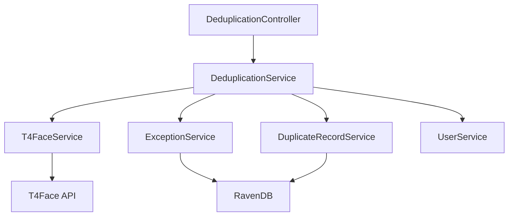
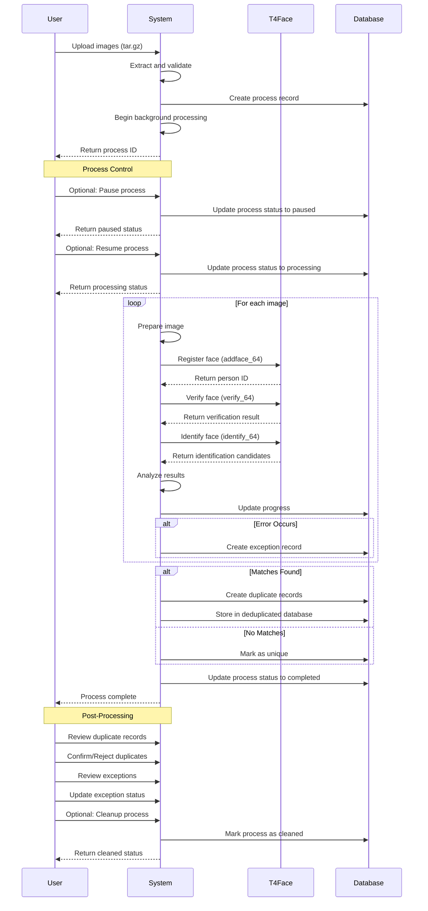

# Deduplication System Documentation

## Overview

The deduplication system identifies and manages duplicate facial images using advanced facial recognition technology. It helps organizations maintain clean databases by identifying duplicate entries, reducing redundant records, and improving data quality through biometric verification.

## System Architecture



## Core Components

- **Facial Recognition Engine**: Integrates with T4Face API for face detection, matching, and identification
- **Deduplication Process Manager**: Handles the workflow of deduplication tasks
- **Exception Service**: Manages cases where potential duplicates are identified
- **Process Tracking**: Monitors and reports on deduplication process status
- **Image Pre-processor**: Prepares and standardizes images for optimal recognition
- **Duplicate Record Service**: Stores and manages information about identified duplicates

## Technical Implementation

### Facial Recognition Integration

- **Technology**: T4Face API (third-party biometric service)
- **Connection Method**: HTTPS REST API with secure communication
- **Matching Algorithm**: Proprietary neural network architecture for facial feature extraction
- **Confidence Scoring**: 0.0 to 100.0 scale, with configurable thresholds (default: 0.8 or 80%)
- **Error Handling**: Retry logic with proper logging
- **Base URL**: https://137.184.100.1:9557
- **Endpoints Used**:
  - `/personface/addface_64`: For registering faces
  - `/personface/verify_64`: For verifying faces
  - `/personface/identify_64`: For identifying faces against the database

### Deduplication Process Flow



1. **Initialization**: User uploads a tar.gz archive containing images

   - Archive extraction and validation
   - Process creation with metadata (ID, timestamp, status)
   - Files are stored with status "Uploaded"

2. **Pre-processing**: Images are prepared for facial recognition

   - Files are validated for supported formats (jpg, jpeg, png)
   - Process status is updated to "Processing"
   - Each file is processed individually

3. **Face Registration**: Each face is registered with T4Face API

   - Face is sent to `/personface/addface_64` endpoint
   - A unique person ID is generated for each face
   - Registration status is logged

4. **Face Verification**: Faces are verified against existing records

   - Face is sent to `/personface/verify_64` endpoint
   - Verification results are analyzed
   - Verification status is logged

5. **Face Identification**: Faces are compared against the entire database

   - Face is sent to `/personface/identify_64` endpoint
   - Identification candidates are returned with confidence scores
   - Candidates are filtered based on confidence threshold (default: 0.8 or 80%)

6. **Duplicate Detection**: Potential duplicates are identified

   - Matches above the confidence threshold are considered duplicates
   - Duplicate information is stored in the deduplicated database
   - Each duplicate record contains original file information and all matches

7. **Results Storage**: Duplicate records are stored for later review

   - Records are stored in the deduplicated database with status "Detected"
   - Each record includes the original file ID, file name, and list of duplicates
   - Each duplicate entry includes file name, confidence score, and person ID

8. **Process Control**: The deduplication process can be controlled

   - Process can be paused with the pause endpoint
   - Paused process can be resumed with the resume endpoint
   - Completed process can be cleaned up with the cleanup endpoint

9. **Exception Handling**: Exceptions during processing are tracked
   - Exceptions are stored in the Exceptions database
   - Each exception includes the process ID, file ID, and error details
   - Exceptions can be reviewed and resolved through the API

## Performance Optimization

- **Asynchronous Processing**: Deduplication runs as a background process
- **Image Compression**: Large images are compressed before sending to T4Face API
- **Efficient Database Access**: RavenDB is used for fast document storage and retrieval
- **Logging**: Comprehensive logging for monitoring and debugging
- **Error Handling**: Robust error handling for API failures
- **Database Organization**: Separate databases for different types of data (processes, files, deduplicated records)

## API Endpoints

### Upload Files for Deduplication

- **Endpoint:** `POST /api/Uploading/upload`
- **Description:** Uploads a tar.gz archive containing images for deduplication
- **Authentication:** Required (JWT)
- **Request Body:** multipart/form-data with file
- **Response:** Process ID and initial status
  ```json
  {
    "processId": "processes/c8f1a017-fdc7-474d-8894-85e9587f4d10",
    "status": "uploaded",
    "fileCount": 3
  }
  ```
- **Status Codes:**
  - 200: Files uploaded successfully
  - 400: Invalid file format
  - 401: Unauthorized

### Start Deduplication Process

- **Endpoint:** `POST /api/Deduplication/process/{processId}`
- **Description:** Initiates deduplication for a previously uploaded process
- **Authentication:** Required (JWT)
- **Path Parameters:**
  - processId: The ID of the process to deduplicate
- **Response:** Process status
  ```json
  {
    "processId": "processes/c8f1a017-fdc7-474d-8894-85e9587f4d10",
    "status": "processing"
  }
  ```
- **Status Codes:**
  - 200: Process started successfully
  - 404: Process not found
  - 401: Unauthorized

### Get Process Status

- **Endpoint:** `GET /api/Deduplication/process/{processId}`
- **Description:** Retrieves the current status of a deduplication process
- **Authentication:** Required (JWT)
- **Path Parameters:**
  - processId: The ID of the process to check
- **Response:** Process information
  ```json
  {
    "processId": "processes/c8f1a017-fdc7-474d-8894-85e9587f4d10",
    "status": "completed",
    "createdAt": "2023-06-21T10:15:00Z",
    "completedAt": "2023-06-21T10:18:30Z",
    "fileCount": 3,
    "processedFiles": 3,
    "duplicatesFound": 1
  }
  ```
- **Status Codes:**
  - 200: Status retrieved successfully
  - 401: Unauthorized
  - 404: Process not found

### Get Duplicate Records

- **Endpoint:** `GET /api/Deduplication/duplicates/{processId}`
- **Description:** Retrieves the duplicate records for a completed deduplication process
- **Authentication:** Required (JWT)
- **Path Parameters:**
  - processId: The ID of the process to get duplicates for
- **Response:** List of duplicate records
  ```json
  [
    {
      "id": "DuplicatedRecords/84d5d276-35dc-498a-b7d4-aa419c77129f",
      "processId": "processes/c8f1a017-fdc7-474d-8894-85e9587f4d10",
      "originalFileId": "8fc268ad-7ed0-472c-8fd6-23a04d7c0ea4",
      "originalFileName": "6a673b97e101fa78f43237f447e4bb69.jpg",
      "detectedDate": "2023-06-21T10:42:05.8213110Z",
      "duplicates": [
        {
          "fileId": "",
          "fileName": "person_7ff65cd7a1",
          "confidence": 100,
          "personId": "46"
        },
        {
          "fileId": "",
          "fileName": "person_7ff65cd7a1",
          "confidence": 100,
          "personId": "36"
        }
      ],
      "status": "Detected",
      "confirmationUser": "",
      "confirmationDate": null,
      "notes": null
    }
  ]
  ```
- **Status Codes:**
  - 200: Duplicates retrieved successfully
  - 401: Unauthorized
  - 404: Process not found

### Get All Processes

- **Endpoint:** `GET /api/Deduplication/processes`
- **Description:** Retrieves all deduplication processes
- **Authentication:** Required (JWT)
- **Response:** List of processes
  ```json
  [
    {
      "id": "processes/c8f1a017-fdc7-474d-8894-85e9587f4d10",
      "name": "Process_20230621121510",
      "username": "user@example.com",
      "createdAt": "2023-06-21T10:15:10Z",
      "completedAt": "2023-06-21T10:18:30Z",
      "status": "completed",
      "fileCount": 3,
      "duplicatesFound": 1
    }
  ]
  ```
- **Status Codes:**
  - 200: Processes retrieved successfully
  - 401: Unauthorized

### Pause Deduplication Process

- **Endpoint:** `POST /api/Deduplication/pause/{processId}`
- **Description:** Pauses a running deduplication process
- **Authentication:** Required (JWT)
- **Path Parameters:**
  - processId: The ID of the process to pause
- **Response:** Process status
  ```json
  {
    "processId": "processes/c8f1a017-fdc7-474d-8894-85e9587f4d10",
    "status": "paused"
  }
  ```
- **Status Codes:**
  - 200: Process paused successfully
  - 400: Process cannot be paused (not in a running state)
  - 401: Unauthorized
  - 404: Process not found

### Resume Deduplication Process

- **Endpoint:** `POST /api/Deduplication/resume/{processId}`
- **Description:** Resumes a paused deduplication process
- **Authentication:** Required (JWT)
- **Path Parameters:**
  - processId: The ID of the process to resume
- **Response:** Process status
  ```json
  {
    "processId": "processes/c8f1a017-fdc7-474d-8894-85e9587f4d10",
    "status": "processing"
  }
  ```
- **Status Codes:**
  - 200: Process resumed successfully
  - 400: Process cannot be resumed (not in a paused state)
  - 401: Unauthorized
  - 404: Process not found

### Cleanup Deduplication Process

- **Endpoint:** `POST /api/Deduplication/cleanup/{processId}`
- **Description:** Cleans up resources associated with a completed deduplication process
- **Authentication:** Required (JWT)
- **Path Parameters:**
  - processId: The ID of the process to clean up
- **Response:** Process status
  ```json
  {
    "processId": "processes/c8f1a017-fdc7-474d-8894-85e9587f4d10",
    "status": "cleaned"
  }
  ```
- **Status Codes:**
  - 200: Process cleaned up successfully
  - 400: Process cannot be cleaned up (not in a completed state)
  - 401: Unauthorized
  - 404: Process not found

### Confirm Duplicate

- **Endpoint:** `POST /api/Deduplication/confirm-duplicate/{duplicateId}`
- **Description:** Confirms a duplicate record
- **Authentication:** Required (JWT)
- **Path Parameters:**
  - duplicateId: The ID of the duplicate record to confirm
- **Request Body:**
  ```json
  {
    "notes": "Confirmed duplicate, this is the same person"
  }
  ```
- **Response:** Updated duplicate record
  ```json
  {
    "id": "DuplicatedRecords/84d5d276-35dc-498a-b7d4-aa419c77129f",
    "status": "Confirmed",
    "confirmationUser": "user@example.com",
    "confirmationDate": "2023-06-21T11:30:00Z",
    "notes": "Confirmed duplicate, this is the same person"
  }
  ```
- **Status Codes:**
  - 200: Duplicate confirmed successfully
  - 401: Unauthorized
  - 404: Duplicate record not found

## T4Face Integration

### Overview

The deduplication system integrates with the T4Face API for facial recognition, detection, and matching. This integration is a core component of the system, enabling accurate identification of duplicate facial records.

### API Configuration

- **Base URL**: `https://137.184.100.1:9557`
- **Protocol**: HTTPS (secure communication)
- **Authentication**: API key-based authentication
- **Timeout**: 30 seconds (configurable)
- **Retry Logic**: 3 retries with exponential backoff

### Key Endpoints

1. **Face Registration** (`/personface/addface_64`)

   - **Purpose**: Register a new face in the T4Face database
   - **Input**: Base64-encoded image
   - **Output**: Person ID and registration status
   - **Error Handling**: Retries on network errors, logs detailed error information

2. **Face Verification** (`/personface/verify_64`)

   - **Purpose**: Verify a face against a specific person ID
   - **Input**: Base64-encoded image and person ID
   - **Output**: Verification result with confidence score
   - **Threshold**: 0.8 (80%) confidence by default

3. **Face Identification** (`/personface/identify_64`)
   - **Purpose**: Identify a face against the entire database
   - **Input**: Base64-encoded image
   - **Output**: List of potential matches with confidence scores
   - **Filtering**: Results filtered based on confidence threshold

### Performance Optimization

- **Image Compression**: Images larger than 500KB are automatically compressed
- **Format Conversion**: Images are converted to optimal format for processing
- **Caching**: Person IDs are cached to reduce API calls
- **Batch Processing**: Images are processed in batches for efficiency

### Error Handling

- **Network Errors**: Automatic retry with exponential backoff
- **API Errors**: Detailed logging with error codes and descriptions
- **Timeout Handling**: Graceful handling of timeout scenarios
- **Exception Recording**: All API errors are recorded in the Exceptions database

### Security Considerations

- **HTTPS**: All communication with T4Face API is encrypted
- **API Key Security**: API keys are stored securely in configuration
- **Data Protection**: Images are processed in memory and not persisted
- **Audit Logging**: All API calls are logged for security auditing

## Performance Considerations

- Deduplication processes run asynchronously in the background
- Each file is processed individually to ensure accurate results
- RavenDB is used for efficient document storage and retrieval
- Separate databases are used for different types of data:
  - processes: Stores process metadata
  - files: Stores file information
  - deduplicated: Stores duplicate records
- Comprehensive logging provides visibility into the deduplication process
- Image compression reduces bandwidth usage and improves API response times

## Error Handling

- All API calls are wrapped in try-catch blocks with proper error logging
- Network failures with T4Face API are logged with detailed error messages
- Validation ensures only supported image formats are processed (JPEG, PNG, JPG)
- Large images (>500KB) are automatically compressed to prevent API errors
- Detailed logging at the Information level provides visibility into the process
- Error responses include appropriate HTTP status codes and error messages
- Process continues even if individual files fail, ensuring robustness

## Data Storage

- **RavenDB** is used as the document database for all data storage
- **Process metadata** stored with document IDs in format `processes/{id}`
- **File information** stored with document IDs in format `{fileId}`
- **Duplicate records** stored in the deduplicated database with IDs in format `DuplicatedRecords/{guid}`
- **Duplicate record structure**:
  ```json
  {
    "Id": "DuplicatedRecords/84d5d276-35dc-498a-b7d4-aa419c77129f",
    "ProcessId": "processes/c8f1a017-fdc7-474d-8894-85e9587f4d10",
    "OriginalFileId": "8fc268ad-7ed0-472c-8fd6-23a04d7c0ea4",
    "OriginalFileName": "6a673b97e101fa78f43237f447e4bb69.jpg",
    "DetectedDate": "2023-06-21T10:42:05.8213110Z",
    "Duplicates": [
      {
        "FileId": "",
        "FileName": "person_7ff65cd7a1",
        "Confidence": 100,
        "PersonId": "46"
      }
    ],
    "Status": "Detected",
    "ConfirmationUser": "",
    "ConfirmationDate": null,
    "Notes": null
  }
  ```
- Uploaded files are temporarily stored on disk and then processed
- T4Face API stores facial features in its own database with person IDs

## Security Considerations

- All API endpoints require JWT authentication
- HTTPS is used for all API communication
- Secure communication with T4Face API using HTTPS
- Detailed logging for audit and troubleshooting purposes
- Uploaded files are validated before processing
- RavenDB access is secured with proper authentication
- File access is restricted to authenticated users
- Sensitive operations require proper authorization
