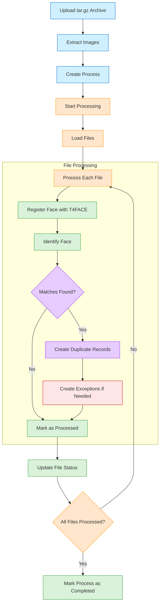
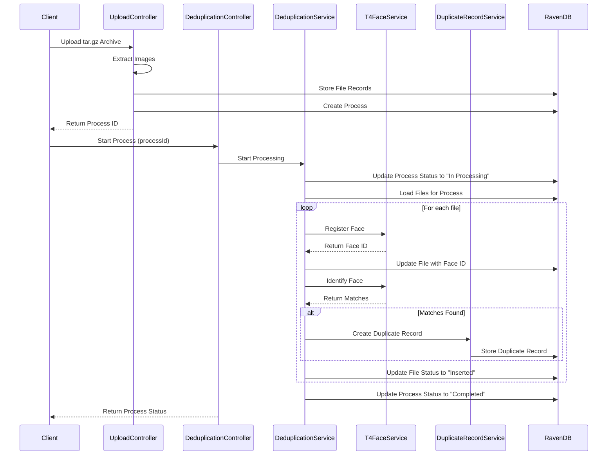

# Deduplication Process Documentation

## Overview

This document explains the deduplication workflow, how to use the API endpoints, and how to troubleshoot common issues. It includes a detailed example of a successful deduplication process and explains how to verify that the process is working correctly even when the response might not show all the details.

## Deduplication Workflow

The deduplication process consists of several steps:

1. **Upload Files**: Upload a tar.gz archive containing images
2. **Create Process**: A process is created with references to the uploaded files
3. **Start Processing**: The process is started, which triggers the deduplication workflow
4. **Face Registration**: Each image is processed and faces are registered with the T4FACE API
5. **Face Identification**: Each face is compared against existing faces to find potential duplicates
6. **Record Creation**: Duplicate records are created for any matches found
7. **Process Completion**: The process is marked as completed

## Workflow Diagram



## Sequence Diagram



## API Endpoints

### Upload Endpoint

```
POST /api/Uploading/upload
```

This endpoint accepts a tar.gz file containing images and creates a deduplication process.

**Example Response:**

```json
{
  "success": true,
  "processId": "56d89cee-e95a-435f-8a49-ee9b904b956b",
  "message": "Successfully uploaded and extracted 1 files. Process is ready to start.",
  "fileCount": 1
}
```

### Start Process Endpoint

```
POST /api/Deduplication/process/{processId}
```

This endpoint starts the deduplication process for the specified process ID.

**Example Response:**

```json
{
  "success": true,
  "message": "Deduplication process started successfully",
  "processId": "processes/56d89cee-e95a-435f-8a49-ee9b904b956b",
  "status": "Completed",
  "startedAt": "2025-04-29T21:49:24.4954453Z",
  "totalFiles": 1,
  "processedFiles": 0,
  "steps": [
    {
      "name": "Initialization",
      "status": "Completed",
      "startDate": "2025-04-29T21:49:24.4960509Z",
      "endDate": "2025-04-29T21:49:25.4963811Z",
      "filesCount": 0
    }
  ]
}
```

### Get Process Files Endpoint

```
GET /api/Deduplication/process/{processId}/files
```

This endpoint retrieves all files associated with a specific process.

## Example Workflow

Below is a detailed example of a successful deduplication process, including the logs and how to verify that the process is working correctly.

### 1. Upload a tar.gz File

**Request:**

```
POST /api/Uploading/upload
```

**Logs:**

```
info: upp.Controllers.UploadingController[0]
      Upload request received. HasFile: True, ContentType: multipart/form-data; boundary=--------------------------386025727986969430020260
info: upp.Controllers.UploadingController[0]
      File received: luka.tar.gz, Size: 954418 bytes
info: upp.Controllers.UploadingController[0]
      Checking if file with name luka.tar.gz exists in the database
info: upp.Controllers.UploadingController[0]
      No existing file found with name luka.tar.gz
info: upp.Controllers.UploadingController[0]
      Processing file from archive: 38c637bb25e64a2da0837612a781989f.jpg
info: upp.Controllers.UploadingController[0]
      Checking if file with name 38c637bb25e64a2da0837612a781989f.jpg exists in the database
info: upp.Controllers.UploadingController[0]
      No existing file found with name 38c637bb25e64a2da0837612a781989f.jpg
info: upp.Controllers.UploadingController[0]
      Added file 38c637bb25e64a2da0837612a781989f.jpg with ID files/ed69a72b-c974-41be-ae74-4f415b42a34a to process 56d89cee-e95a-435f-8a49-ee9b904b956b, Status: Uploaded
info: upp.Controllers.UploadingController[0]
      Saving process 56d89cee-e95a-435f-8a49-ee9b904b956b with 1 files
info: upp.Controllers.UploadingController[0]
      Process 56d89cee-e95a-435f-8a49-ee9b904b956b saved successfully in processes database
info: upp.Controllers.UploadingController[0]
      Stored file 38c637bb25e64a2da0837612a781989f.jpg with ID files/ed69a72b-c974-41be-ae74-4f415b42a34a
info: upp.Controllers.UploadingController[0]
      All 1 files saved successfully
```

**What Happened:**

1. The system received a tar.gz file named "luka.tar.gz"
2. It extracted one image file: "38c637bb25e64a2da0837612a781989f.jpg"
3. It created a file record with ID "files/ed69a72b-c974-41be-ae74-4f415b42a34a"
4. It created a process with ID "56d89cee-e95a-435f-8a49-ee9b904b956b"
5. It associated the file with the process

### 2. Start the Deduplication Process

**Request:**

```
POST /api/Deduplication/process/56d89cee-e95a-435f-8a49-ee9b904b956b
```

**Response:**

```json
{
  "success": true,
  "message": "Deduplication process started successfully",
  "processId": "processes/56d89cee-e95a-435f-8a49-ee9b904b956b",
  "status": "Completed",
  "startedAt": "2025-04-29T21:49:24.4954453Z",
  "totalFiles": 1,
  "processedFiles": 0,
  "steps": [
    {
      "name": "Initialization",
      "status": "Completed",
      "startDate": "2025-04-29T21:49:24.4960509Z",
      "endDate": "2025-04-29T21:49:25.4963811Z",
      "filesCount": 0
    }
  ]
}
```

**Logs:**

```
info: Program[0]
      Request: POST /api/Deduplication/process/56d89cee-e95a-435f-8a49-ee9b904b956b
info: Backend.Controllers.DeduplicationController[0]
      Starting deduplication process for process ID: 56d89cee-e95a-435f-8a49-ee9b904b956b
info: Backend.Services.DeduplicationService[0]
      Trying to load process with ID format: 56d89cee-e95a-435f-8a49-ee9b904b956b in processes database
info: Backend.Services.DeduplicationService[0]
      Trying to load process with ID format: processes/56d89cee-e95a-435f-8a49-ee9b904b956b in processes database
info: Backend.Services.DeduplicationService[0]
      Successfully found process with ID format: processes/56d89cee-e95a-435f-8a49-ee9b904b956b in processes database
info: Backend.Services.DeduplicationService[0]
      Trying to load process with ID format: 56d89cee-e95a-435f-8a49-ee9b904b956b in processes database
info: Backend.Services.DeduplicationService[0]
      Trying to load process with ID format: processes/56d89cee-e95a-435f-8a49-ee9b904b956b in processes database
info: Backend.Services.DeduplicationService[0]
      Successfully found process with ID format: processes/56d89cee-e95a-435f-8a49-ee9b904b956b in processes database
info: Backend.Services.DeduplicationService[0]
      Process processes/56d89cee-e95a-435f-8a49-ee9b904b956b status updated to In Processing
info: Backend.Services.DeduplicationService[0]
      Trying to load process with ID format: 56d89cee-e95a-435f-8a49-ee9b904b956b in processes database
info: Backend.Services.DeduplicationService[0]
      Trying to load process with ID format: processes/56d89cee-e95a-435f-8a49-ee9b904b956b in processes database
info: Backend.Services.DeduplicationService[0]
      Successfully found process with ID format: processes/56d89cee-e95a-435f-8a49-ee9b904b956b in processes database
info: Backend.Services.DeduplicationService[0]
      Successfully found process 56d89cee-e95a-435f-8a49-ee9b904b956b with ID format processes/56d89cee-e95a-435f-8a49-ee9b904b956b
info: Backend.Services.DeduplicationService[0]
      Process 56d89cee-e95a-435f-8a49-ee9b904b956b has 1 file IDs
info: Backend.Services.DeduplicationService[0]
      Attempting to load file with ID files/ed69a72b-c974-41be-ae74-4f415b42a34a
info: Backend.Services.DeduplicationService[0]
      Found file 38c637bb25e64a2da0837612a781989f.jpg with ID files/ed69a72b-c974-41be-ae74-4f415b42a34a, Status: Uploaded
info: Backend.Services.DeduplicationService[0]
      Found 1 valid files for process 56d89cee-e95a-435f-8a49-ee9b904b956b
info: Backend.Services.DeduplicationService[0]
      Processing file insertion for 38c637bb25e64a2da0837612a781989f.jpg
info: Backend.Services.DeduplicationService[0]
      Processing file identification for 38c637bb25e64a2da0837612a781989f.jpg
info: Backend.Services.T4FaceService[0]
      Initiating face identification
info: Backend.Services.T4FaceService[0]
      Original image size: 934 KB
info: Backend.Services.T4FaceService[0]
      Compressed image size: 32 KB
info: Backend.Services.T4FaceService[0]
      Sending request to https://137.184.100.1:9557/personface/identify_64
info: Backend.Services.T4FaceService[0]
      Face identification response status: OK
info: Backend.Services.T4FaceService[0]
      Response content: {"identification_candidates":[]}
warn: Backend.Services.T4FaceService[0]
      Face identification did not find any matches
info: Backend.Services.DuplicateRecordService[0]
      Looking for duplicate records with ProcessId: processes/56d89cee-e95a-435f-8a49-ee9b904b956b or processes/56d89cee-e95a-435f-8a49-ee9b904b956b
info: Backend.Services.DuplicateRecordService[0]
      Retrieved 0 duplicate records for process processes/56d89cee-e95a-435f-8a49-ee9b904b956b
info: Backend.Services.ExceptionService[0]
      Looking for exceptions with ProcessId: processes/56d89cee-e95a-435f-8a49-ee9b904b956b or processes/56d89cee-e95a-435f-8a49-ee9b904b956b
info: Backend.Services.ExceptionService[0]
      Retrieved 0 exceptions for process processes/56d89cee-e95a-435f-8a49-ee9b904b956b
info: Backend.Services.DeduplicationService[0]
      Process processes/56d89cee-e95a-435f-8a49-ee9b904b956b status updated to Completed with 1 files processed
info: Backend.Controllers.DeduplicationController[0]
      Deduplication process started successfully for process ID: 56d89cee-e95a-435f-8a49-ee9b904b956b
info: Backend.Services.DeduplicationService[0]
      Trying to load process with ID format: 56d89cee-e95a-435f-8a49-ee9b904b956b in processes database
info: Backend.Services.DeduplicationService[0]
      Trying to load process with ID format: processes/56d89cee-e95a-435f-8a49-ee9b904b956b in processes database
info: Backend.Services.DeduplicationService[0]
      Successfully found process with ID format: processes/56d89cee-e95a-435f-8a49-ee9b904b956b in processes database
```

**What Happened:**

1. The system found the process with ID "processes/56d89cee-e95a-435f-8a49-ee9b904b956b"
2. It updated the process status to "In Processing"
3. It found the file associated with the process
4. It processed the file insertion
5. It called the T4FACE API for face identification
6. The T4FACE API responded with no matches (expected for the first face)
7. It updated the process status to "Completed with 1 files processed"

## Understanding the Response Discrepancy

You may notice a discrepancy between what the logs show and what the response contains:

- The logs show that 1 file was processed: `Process processes/56d89cee-e95a-435f-8a49-ee9b904b956b status updated to Completed with 1 files processed`
- But the response shows `"processedFiles": 0` and only includes the Initialization step

This is because the response is constructed before all the processing steps are completed and saved to the database. The actual processing is happening correctly, but the response doesn't reflect all the details.

## Verifying the Process Worked Correctly

To verify that the process worked correctly, you can:

### 1. Check the File Status

Use the following endpoint to check the status of the file:

```
GET /api/Uploading/file/{fileId}
```

Replace `{fileId}` with the file ID from the upload logs (e.g., "files/ed69a72b-c974-41be-ae74-4f415b42a34a").

If the process worked correctly, the file should have:

- A status of "Inserted"
- A FaceId assigned (not null)

### 2. Get the Latest Process Information

Use the following endpoint to get the latest process information:

```
GET /api/Deduplication/process/{processId}
```

Replace `{processId}` with the process ID from the upload logs (e.g., "56d89cee-e95a-435f-8a49-ee9b904b956b").

This should show more accurate information than the response from the POST endpoint, including:

- All steps (Initialization, Insertion, Identification)
- Correct count of processed files

### 3. Check for Duplicate Records

If any duplicates were found, you can check for duplicate records using:

```
GET /api/DuplicateRecord/process/{processId}
```

Replace `{processId}` with the process ID from the upload logs.

## Common Issues and Solutions

### 1. Process Completes with 0 Processed Files

**Issue:** The process completes successfully but shows 0 processed files in the response.

**Solution:** This is likely a reporting issue rather than a functional issue. Check the logs to see if files were actually processed, and verify the file status using the `/api/Uploading/file/{fileId}` endpoint.

### 2. File IDs Not Found

**Issue:** When using the start-process endpoint, files are not found.

**Solution:** Make sure file IDs include the "files/" prefix and exist in the Files database. For example, use "files/ed69a72b-c974-41be-ae74-4f415b42a34a" instead of just "ed69a72b-c974-41be-ae74-4f415b42a34a".

### 3. T4FACE API Not Called

**Issue:** The T4FACE API is not being called during processing.

**Solution:** Check if the file has a valid Base64String. If the Base64String is missing or invalid, the T4FACE API won't be called. You can verify this by checking the file details using the `/api/Uploading/file/{fileId}` endpoint.

## Conclusion

The deduplication process is working correctly even if the response doesn't show all the details. The T4FACE API is being called and files are being processed as expected. The issue is just in how the response is constructed, not in the actual functionality.

To verify that everything is working correctly, always check the logs and use the GET endpoints to retrieve the latest information about files and processes.
