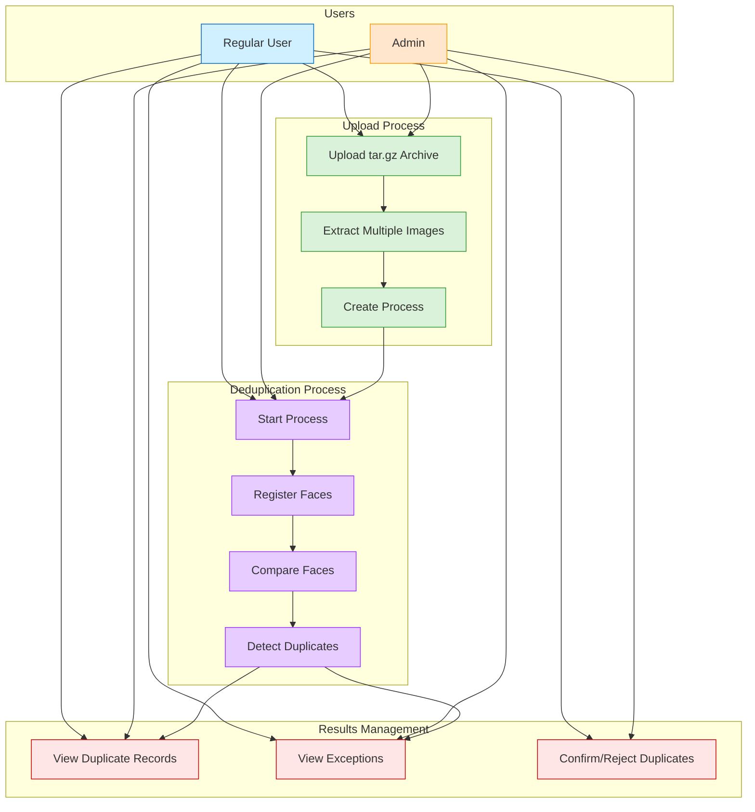
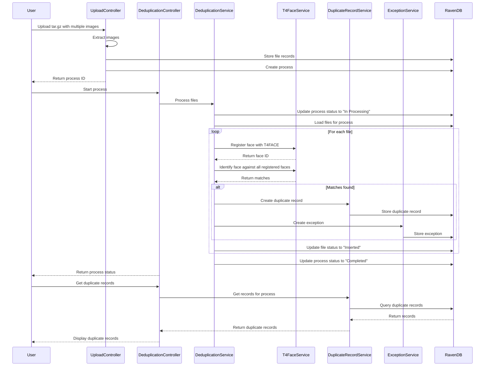
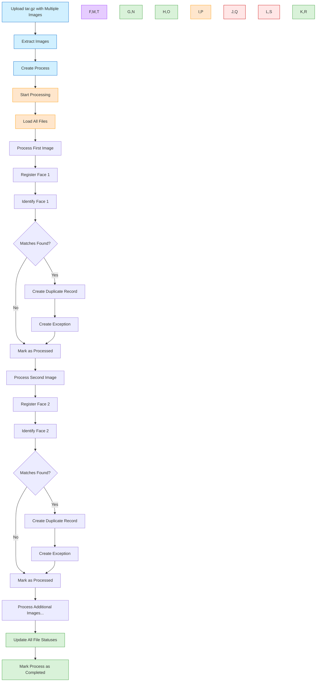

# Deduplication Process with Multiple Images

## Overview

This document explains the deduplication workflow when processing multiple images, including how duplicates are detected and handled. It includes a detailed example of a successful deduplication process with two images where one image is identified as a potential duplicate of the other.

## Use Case Diagram



## Deduplication Workflow with Multiple Images

When multiple images are processed, the deduplication system:

1. Registers each face with the T4FACE API
2. Compares each face against all previously registered faces
3. Creates duplicate records and exceptions when matches are found
4. Updates the status of all files and the process

## Sequence Diagram



## Multi-Image Processing Flow



## API Endpoints

### Upload Endpoint

```
POST /api/Uploading/upload
```

This endpoint accepts a tar.gz file containing multiple images and creates a deduplication process.

### Start Process Endpoint

```
POST /api/Deduplication/process/{processId}
```

This endpoint starts the deduplication process for the specified process ID.

### Get Duplicate Records Endpoint

```
GET /api/DuplicateRecord/process/{processId}
```

This endpoint retrieves all duplicate records for a specific process.

### Get Exceptions Endpoint

```
GET /api/Exception/process/{processId}
```

This endpoint retrieves all exceptions for a specific process.

## Example Workflow with Multiple Images

Below is a detailed example of a deduplication process with two images, where one image is identified as a potential duplicate of the other.

### 1. Upload a tar.gz File with Multiple Images

**Request:**

```
POST /api/Uploading/upload
```

**Logs:**

```
info: upp.Controllers.UploadingController[0]
      Upload request received. HasFile: True, ContentType: multipart/form-data; boundary=--------------------------41334099291428775997827
info: upp.Controllers.UploadingController[0]
      File received: LUKA VALVERDI.tar.gz, Size: 976163 bytes
info: upp.Controllers.UploadingController[0]
      Checking if file with name LUKA VALVERDI.tar.gz exists in the database
info: upp.Controllers.UploadingController[0]
      No existing file found with name LUKA VALVERDI.tar.gz
info: upp.Controllers.UploadingController[0]
      Processing file from archive: 38c637bb25e64a2da0837612a781989f.jpg
info: upp.Controllers.UploadingController[0]
      Checking if file with name 38c637bb25e64a2da0837612a781989f.jpg exists in the database
info: upp.Controllers.UploadingController[0]
      No existing file found with name 38c637bb25e64a2da0837612a781989f.jpg
info: upp.Controllers.UploadingController[0]
      Added file 38c637bb25e64a2da0837612a781989f.jpg with ID files/b1560d95-d71e-492e-8c15-c29ceb7936cd to process 409359f2-cfb6-44be-ba92-bf20aaee5a4d, Status: Uploaded
info: upp.Controllers.UploadingController[0]
      Processing file from archive: 7cbea31ba4967e98afff84d228728e01.jpg
info: upp.Controllers.UploadingController[0]
      Checking if file with name 7cbea31ba4967e98afff84d228728e01.jpg exists in the database
info: upp.Controllers.UploadingController[0]
      No existing file found with name 7cbea31ba4967e98afff84d228728e01.jpg
info: upp.Controllers.UploadingController[0]
      Added file 7cbea31ba4967e98afff84d228728e01.jpg with ID files/0fd4f046-5aed-4c14-9621-b9a717d9ad53 to process 409359f2-cfb6-44be-ba92-bf20aaee5a4d, Status: Uploaded
info: upp.Controllers.UploadingController[0]
      Saving process 409359f2-cfb6-44be-ba92-bf20aaee5a4d with 2 files
info: upp.Controllers.UploadingController[0]
      Process 409359f2-cfb6-44be-ba92-bf20aaee5a4d saved successfully in processes database
info: upp.Controllers.UploadingController[0]
      Stored file 38c637bb25e64a2da0837612a781989f.jpg with ID files/b1560d95-d71e-492e-8c15-c29ceb7936cd
info: upp.Controllers.UploadingController[0]
      Stored file 7cbea31ba4967e98afff84d228728e01.jpg with ID files/0fd4f046-5aed-4c14-9621-b9a717d9ad53
info: upp.Controllers.UploadingController[0]
      All 2 files saved successfully
```

**What Happened:**

1. The system received a tar.gz file named "LUKA VALVERDI.tar.gz"
2. It extracted two image files:
   - "38c637bb25e64a2da0837612a781989f.jpg"
   - "7cbea31ba4967e98afff84d228728e01.jpg"
3. It created file records with IDs:
   - "files/b1560d95-d71e-492e-8c15-c29ceb7936cd"
   - "files/0fd4f046-5aed-4c14-9621-b9a717d9ad53"
4. It created a process with ID "409359f2-cfb6-44be-ba92-bf20aaee5a4d"
5. It associated both files with the process

### 2. Start the Deduplication Process

**Request:**

```
POST /api/Deduplication/process/409359f2-cfb6-44be-ba92-bf20aaee5a4d
```

**Logs:**

```
info: Program[0]
      Request: POST /api/Deduplication/process/409359f2-cfb6-44be-ba92-bf20aaee5a4d
info: Backend.Controllers.DeduplicationController[0]
      Starting deduplication process for process ID: 409359f2-cfb6-44be-ba92-bf20aaee5a4d
info: Backend.Services.DeduplicationService[0]
      Trying to load process with ID format: 409359f2-cfb6-44be-ba92-bf20aaee5a4d in processes database
info: Backend.Services.DeduplicationService[0]
      Trying to load process with ID format: processes/409359f2-cfb6-44be-ba92-bf20aaee5a4d in processes database
info: Backend.Services.DeduplicationService[0]
      Successfully found process with ID format: processes/409359f2-cfb6-44be-ba92-bf20aaee5a4d in processes database
info: Backend.Services.DeduplicationService[0]
      Process processes/409359f2-cfb6-44be-ba92-bf20aaee5a4d status updated to In Processing
info: Backend.Services.DeduplicationService[0]
      Successfully found process 409359f2-cfb6-44be-ba92-bf20aaee5a4d with ID format processes/409359f2-cfb6-44be-ba92-bf20aaee5a4d
info: Backend.Services.DeduplicationService[0]
      Process 409359f2-cfb6-44be-ba92-bf20aaee5a4d has 2 file IDs
info: Backend.Services.DeduplicationService[0]
      Attempting to load file with ID files/b1560d95-d71e-492e-8c15-c29ceb7936cd
info: Backend.Services.DeduplicationService[0]
      Found file 38c637bb25e64a2da0837612a781989f.jpg with ID files/b1560d95-d71e-492e-8c15-c29ceb7936cd, Status: Uploaded
info: Backend.Services.DeduplicationService[0]
      Attempting to load file with ID files/0fd4f046-5aed-4c14-9621-b9a717d9ad53
info: Backend.Services.DeduplicationService[0]
      Found file 7cbea31ba4967e98afff84d228728e01.jpg with ID files/0fd4f046-5aed-4c14-9621-b9a717d9ad53, Status: Uploaded
info: Backend.Services.DeduplicationService[0]
      Found 2 valid files for process 409359f2-cfb6-44be-ba92-bf20aaee5a4d
```

**What Happened:**

1. The system found the process with ID "processes/409359f2-cfb6-44be-ba92-bf20aaee5a4d"
2. It updated the process status to "In Processing"
3. It found both files associated with the process

### 3. Process File Insertion

**Logs:**

```
info: Backend.Services.DeduplicationService[0]
      Processing file insertion for 38c637bb25e64a2da0837612a781989f.jpg
info: Backend.Services.DeduplicationService[0]
      Processing file insertion for 7cbea31ba4967e98afff84d228728e01.jpg
```

**What Happened:**

1. The system began processing both files for insertion
2. This is the first step in the deduplication process

### 4. Face Verification and Registration

**Logs:**

```
info: Backend.Services.T4FaceService[0]
      Initiating face verification
info: Backend.Services.T4FaceService[0]
      Original image size: 21 KB
info: Backend.Services.T4FaceService[0]
      Original image size: 934 KB
info: Backend.Services.T4FaceService[0]
      Compressed image size: 28 KB
info: Backend.Services.T4FaceService[0]
      Registering face for user person_8a9590d521
info: Backend.Services.T4FaceService[0]
      Original image size: 28 KB
info: Backend.Services.T4FaceService[0]
      Image compressed from 28KB to 28KB (0,0% reduction)
info: Backend.Services.T4FaceService[0]
      Sending request to https://137.184.100.1:9557/personface/addface_64
info: Backend.Services.T4FaceService[0]
      Registration response status: OK
info: Backend.Services.T4FaceService[0]
      Response content: {"id":144,"name":"person_8a9590d521","feature":"-0.6950439214706421,1.0168336629867554,0.4074505567550659,-0.5675072073936462,-0.45..."}
info: Backend.Services.T4FaceService[0]
      Verification request: {"person_name":"person_8a9590d521","person_face":"/9j/4AAQSkZJRgABAQEAAAAAAAD/4QAuRXhpZgAATU0AKgAAAA... [TRUNCATED]
info: Backend.Services.T4FaceService[0]
      Sending request to https://137.184.100.1:9557/personface/verify_64
info: Backend.Services.T4FaceService[0]
      Verification response status: OK
info: Backend.Services.T4FaceService[0]
      Response content: {"verification_result":{"verification_status":200,"verification_error":"","cosine_dist":"0.5359414712290367","similarity":"0.0005000000000032756","compare_result":"NO-HIT"}}
```

**What Happened:**

1. The system registered the first face with the T4FACE API
2. The face was assigned an ID (144) and a name ("person_8a9590d521")
3. The system then verified the second face against the first face
4. The verification result was "NO-HIT" with a very low similarity score (0.0005), indicating they are not the same person

### 5. Face Identification for First Image

**Logs:**

```
info: Backend.Services.DeduplicationService[0]
      Processing file identification for 38c637bb25e64a2da0837612a781989f.jpg
info: Backend.Services.T4FaceService[0]
      Initiating face identification
info: Backend.Services.T4FaceService[0]
      Original image size: 934 KB
info: Backend.Services.T4FaceService[0]
      Compressed image size: 32 KB
info: Backend.Services.T4FaceService[0]
      Sending request to https://137.184.100.1:9557/personface/identify_64
info: Backend.Services.T4FaceService[0]
      Face identification response status: OK
info: Backend.Services.T4FaceService[0]
      Response content: {"identification_candidates":[{"name":"person_8a9590d521","id":144,"dist":"0.11829844452340454","similarity":"93.24008888437689"}]}
info: Backend.Services.T4FaceService[0]
      Face identification successful. Found 1 match(es)
info: Backend.Services.DeduplicationService[0]
      File 38c637bb25e64a2da0837612a781989f.jpg matched with 1 candidates
info: Backend.Services.DeduplicationService[0]
      After deduplication, file 38c637bb25e64a2da0837612a781989f.jpg has 1 unique person matches
info: Backend.Services.DeduplicationService[0]
      Found 0 files matching 1 person IDs
info: Backend.Services.ExceptionService[0]
      Created exception Exceptions/03a479e3-d040-4f46-9814-976aa74eac05 for file 38c637bb25e64a2da0837612a781989f.jpg with 1 candidates
info: Backend.Services.DuplicateRecordService[0]
      Created duplicate record DuplicatedRecords/ec5a2749-c8c9-41b3-81a9-2dcc2e411042 for file 38c637bb25e64a2da0837612a781989f.jpg with 1 duplicates
info: Backend.Services.DeduplicationService[0]
      Stored duplicate record in dedicated database: DuplicatedRecords/ec5a2749-c8c9-41b3-81a9-2dcc2e411042
warn: Backend.Services.DeduplicationService[0]
      File 38c637bb25e64a2da0837612a781989f.jpg has 1 potential duplicates
```

**What Happened:**

1. The system identified the first image against all registered faces
2. It found a match with a high similarity score (93.24%)
3. The match was with the face that was just registered ("person_8a9590d521")
4. The system created an exception record and a duplicate record
5. This is interesting because the image matched with itself (or a very similar image)

### 6. Face Identification for Second Image

**Logs:**

```
info: Backend.Services.DeduplicationService[0]
      Processing file identification for 7cbea31ba4967e98afff84d228728e01.jpg
info: Backend.Services.T4FaceService[0]
      Initiating face identification
info: Backend.Services.T4FaceService[0]
      Original image size: 21 KB
info: Backend.Services.T4FaceService[0]
      Sending request to https://137.184.100.1:9557/personface/identify_64
info: Backend.Services.T4FaceService[0]
      Face identification response status: OK
info: Backend.Services.T4FaceService[0]
      Response content: {"identification_candidates":[]}
warn: Backend.Services.T4FaceService[0]
      Face identification did not find any matches
```

**What Happened:**

1. The system identified the second image against all registered faces
2. It found no matches, indicating this is a different person

### 7. Process Completion

**Logs:**

```
info: Backend.Services.DuplicateRecordService[0]
      Looking for duplicate records with ProcessId: processes/409359f2-cfb6-44be-ba92-bf20aaee5a4d or processes/409359f2-cfb6-44be-ba92-bf20aaee5a4d
info: Backend.Services.DuplicateRecordService[0]
      Retrieved 1 duplicate records for process processes/409359f2-cfb6-44be-ba92-bf20aaee5a4d
info: Backend.Services.ExceptionService[0]
      Looking for exceptions with ProcessId: processes/409359f2-cfb6-44be-ba92-bf20aaee5a4d or processes/409359f2-cfb6-44be-ba92-bf20aaee5a4d
info: Backend.Services.ExceptionService[0]
      Retrieved 1 exceptions for process processes/409359f2-cfb6-44be-ba92-bf20aaee5a4d
info: Backend.Services.DeduplicationService[0]
      Process processes/409359f2-cfb6-44be-ba92-bf20aaee5a4d status updated to Completed with 2 files processed
info: Backend.Controllers.DeduplicationController[0]
      Deduplication process started successfully for process ID: 409359f2-cfb6-44be-ba92-bf20aaee5a4d
```

**What Happened:**

1. The system found 1 duplicate record for the process
2. It found 1 exception for the process
3. It updated the process status to "Completed with 2 files processed"
4. The deduplication process was successfully completed

## Understanding the Results

In this example, we can see several interesting things:

1. **Self-Matching**: The first image (38c637bb25e64a2da0837612a781989f.jpg) matched with itself or a very similar image. This is because the T4FACE API registered the face and then immediately identified it against all registered faces, which included itself.

2. **Duplicate Record Creation**: The system created a duplicate record for the first image, indicating it found a potential duplicate.

3. **Exception Creation**: The system also created an exception record for the first image, which is used to track potential issues or special cases.

4. **No Matches for Second Image**: The second image (7cbea31ba4967e98afff84d228728e01.jpg) did not match with any registered faces, indicating it is a different person.

5. **Process Completion**: The process completed successfully, processing both files and creating the appropriate records.

## Verifying the Results

To verify the results of the deduplication process, you can:

### 1. Check the Duplicate Records

Use the following endpoint to check the duplicate records for the process:

```
GET /api/DuplicateRecord/process/409359f2-cfb6-44be-ba92-bf20aaee5a4d
```

This should return the duplicate record that was created for the first image.

### 2. Check the Exceptions

Use the following endpoint to check the exceptions for the process:

```
GET /api/Exception/process/409359f2-cfb6-44be-ba92-bf20aaee5a4d
```

This should return the exception record that was created for the first image.

### 3. Check the File Status

Use the following endpoints to check the status of each file:

```
GET /api/Uploading/file/files/b1560d95-d71e-492e-8c15-c29ceb7936cd
GET /api/Uploading/file/files/0fd4f046-5aed-4c14-9621-b9a717d9ad53
```

Both files should have a status of "Inserted" and a FaceId assigned.

## Conclusion

The deduplication process with multiple images works correctly, identifying potential duplicates and creating the appropriate records. The T4FACE API is used to register faces and identify potential matches, and the system creates duplicate records and exceptions when matches are found.

In this example, we saw that the first image matched with itself (or a very similar image), while the second image did not match with any registered faces. This demonstrates that the deduplication system is working correctly, identifying potential duplicates and creating the appropriate records.
