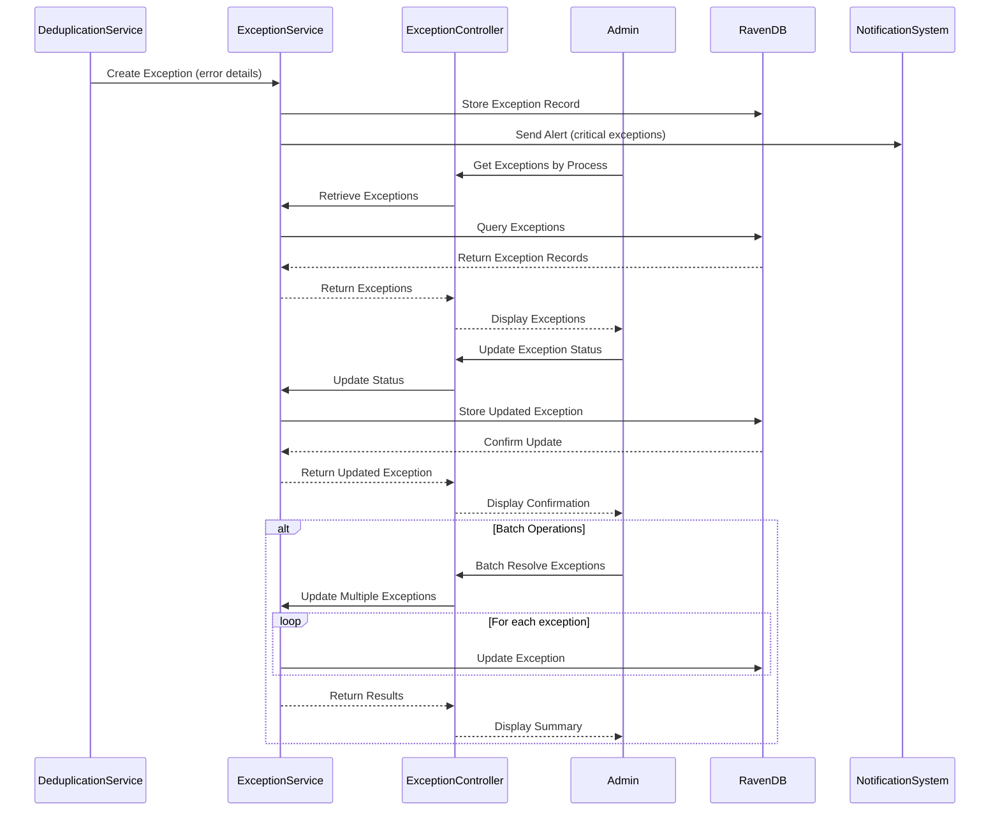
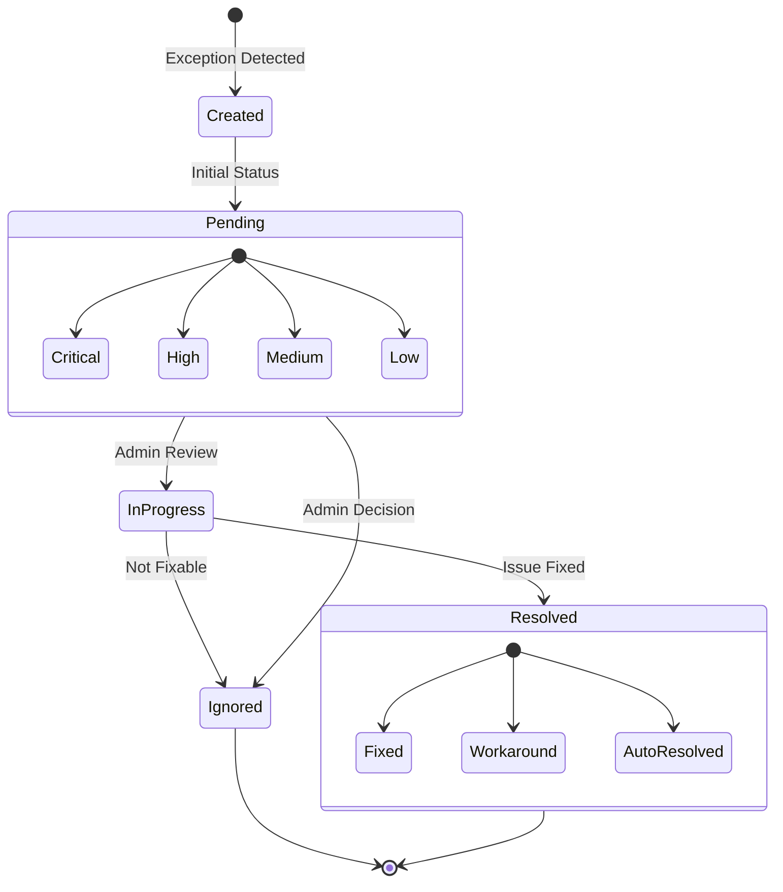
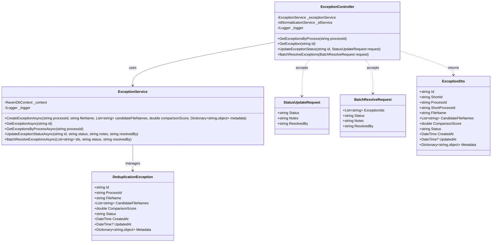

# Exception Handling System Documentation

## Overview

The Exception Handling system tracks and manages issues that occur during the deduplication process. It provides a way to identify, categorize, and resolve problems that arise during image processing, facial recognition, and duplicate detection.

## Use Case Diagram

```mermaid
graph TD
    subgraph Users
        Admin[Administrator]
        SuperAdmin[Super Administrator]
    end

    subgraph Exception Management
        ViewExceptions[View Exceptions]
        FilterExceptions[Filter Exceptions]
        ResolveException[Resolve Exception]
        IgnoreException[Ignore Exception]
        BatchResolve[Batch Resolve Exceptions]
        ExportExceptions[Export Exception Reports]
    end

    subgraph Integration
        ViewProcessDetails[View Process Details]
        ViewFileDetails[View File Details]
        UpdateProcess[Update Process Status]
        NotifyUsers[Send Notifications]
    end

    Admin --> ViewExceptions
    Admin --> FilterExceptions
    Admin --> ResolveException
    Admin --> IgnoreException
    Admin --> ViewProcessDetails
    Admin --> ViewFileDetails

    SuperAdmin --> ViewExceptions
    SuperAdmin --> FilterExceptions
    SuperAdmin --> ResolveException
    SuperAdmin --> IgnoreException
    SuperAdmin --> BatchResolve
    SuperAdmin --> ExportExceptions
    SuperAdmin --> ViewProcessDetails
    SuperAdmin --> ViewFileDetails
    SuperAdmin --> UpdateProcess
    SuperAdmin --> NotifyUsers

    classDef user fill:#d1f0ff,stroke:#0066cc
    classDef admin fill:#ffe6cc,stroke:#ff9900
    classDef exception fill:#d9f2d9,stroke:#339933
    classDef integration fill:#e6ccff,stroke:#9933ff

    class Admin user
    class SuperAdmin admin
    class ViewExceptions,FilterExceptions,ResolveException,IgnoreException,BatchResolve,ExportExceptions exception
    class ViewProcessDetails,ViewFileDetails,UpdateProcess,NotifyUsers integration
```



## Core Components

- **ExceptionService**: Manages the creation, retrieval, and updating of exception records
- **Exception Model**: Defines the structure of exception records
- **Exception Controller**: Provides API endpoints for interacting with exceptions

## Sequence Diagram



## State Diagram



## Class Diagram



## Technical Implementation

### Exception Model

Exception records are stored in the Exceptions database with the following structure:

```json
{
  "Id": "Exceptions/1a2b3c4d-5e6f-7g8h-9i0j-1k2l3m4n5o6p",
  "ProcessId": "processes/7a8b9c0d-1e2f-3g4h-5i6j-7k8l9m0n1o2p",
  "FileId": "files/3a4b5c6d-7e8f-9g0h-1i2j-3k4l5m6n7o8p",
  "FileName": "person_image.jpg",
  "ExceptionType": "FaceDetectionFailed",
  "Message": "No face detected in the image",
  "Status": "Pending",
  "CreatedAt": "2023-06-21T10:15:00Z",
  "ResolvedAt": null,
  "ResolvedBy": null,
  "Notes": null
}
```

### Exception Types

The system supports various exception types to categorize different issues that may occur during the deduplication process. Each exception type has specific characteristics, potential causes, and recommended resolution approaches.

#### Face Detection Exceptions

1. **FaceDetectionFailed**

   - **Description**: No face was detected in the image
   - **Potential Causes**:
     - Poor image quality
     - Face obscured or partially visible
     - Image does not contain a face
     - Face too small in the image
   - **Resolution Approaches**:
     - Request a clearer image
     - Adjust image preprocessing parameters
     - Manual verification of image content
   - **Example Message**: "No face detected in image person_123.jpg"

2. **MultipleFacesDetected**
   - **Description**: Multiple faces were detected in a single image
   - **Potential Causes**:
     - Group photo uploaded
     - Background contains other faces
     - Reflections or photos within photos
   - **Resolution Approaches**:
     - Request individual portrait
     - Crop image to include only one face
     - Mark as invalid for deduplication
   - **Example Message**: "Multiple faces (3) detected in image group_photo.jpg"

#### API Exceptions

3. **ApiConnectionError**

   - **Description**: Error connecting to the T4Face API
   - **Potential Causes**:
     - Network connectivity issues
     - T4Face service unavailable
     - Timeout during API call
     - Invalid API credentials
   - **Resolution Approaches**:
     - Check network connectivity
     - Verify T4Face service status
     - Retry the operation
     - Update API credentials
   - **Example Message**: "Failed to connect to T4Face API: Connection timed out"

4. **ApiResponseError**
   - **Description**: Received error response from T4Face API
   - **Potential Causes**:
     - Invalid request parameters
     - API rate limiting
     - Server-side error in T4Face
   - **Resolution Approaches**:
     - Check request parameters
     - Implement rate limiting
     - Contact T4Face support
   - **Example Message**: "T4Face API returned error code 429: Too Many Requests"

#### Image Processing Exceptions

5. **InvalidImageFormat**

   - **Description**: The image format is not supported
   - **Potential Causes**:
     - Unsupported file extension
     - Corrupted image file
     - Non-image file with image extension
   - **Resolution Approaches**:
     - Convert to supported format (JPEG, PNG)
     - Request new image
     - Verify file integrity
   - **Example Message**: "Unsupported image format: .bmp. Supported formats are: .jpg, .jpeg, .png"

6. **ImageSizeError**

   - **Description**: Image size is outside acceptable parameters
   - **Potential Causes**:
     - Image too large (>10MB)
     - Image too small (<100x100 pixels)
     - Image dimensions disproportionate
   - **Resolution Approaches**:
     - Resize image to acceptable dimensions
     - Request new image
     - Compress oversized images
   - **Example Message**: "Image size too small: 50x50 pixels. Minimum size is 100x100 pixels"

7. **ProcessingError**
   - **Description**: General error during image processing
   - **Potential Causes**:
     - Memory limitations
     - Processing timeout
     - Unexpected image characteristics
   - **Resolution Approaches**:
     - Retry with optimized image
     - Process in smaller batches
     - Adjust processing parameters
   - **Example Message**: "Error processing image: Out of memory exception"

#### Validation Exceptions

8. **ValidationError**
   - **Description**: Image validation failed
   - **Potential Causes**:
     - Image does not meet quality requirements
     - Image contains inappropriate content
     - Image metadata invalid
   - **Resolution Approaches**:
     - Request image that meets guidelines
     - Verify image content
     - Check metadata requirements
   - **Example Message**: "Image validation failed: Quality score below threshold (0.4/1.0)"

#### System Exceptions

9. **DatabaseError**

   - **Description**: Error accessing the database
   - **Potential Causes**:
     - Database connection issues
     - Query execution failure
     - Database inconsistency
   - **Resolution Approaches**:
     - Check database connectivity
     - Verify database integrity
     - Review query parameters
   - **Example Message**: "Failed to save record to database: Connection refused"

10. **SystemResourceError**

    - **Description**: System resource limitation reached
    - **Potential Causes**:
      - Insufficient disk space
      - Memory limitation
      - CPU overload
    - **Resolution Approaches**:
      - Free up system resources
      - Scale up infrastructure
      - Optimize resource usage
    - **Example Message**: "Insufficient disk space to store temporary files"

11. **UnknownError**
    - **Description**: Unspecified error
    - **Potential Causes**:
      - Unexpected system behavior
      - Unhandled exception
      - Third-party component failure
    - **Resolution Approaches**:
      - Check system logs
      - Review error details
      - Escalate to development team
    - **Example Message**: "Unknown error occurred during processing: See logs for details"

### Exception Status

Exceptions can have the following statuses:

- **Pending**: The exception has been created but not yet addressed
- **Resolved**: The exception has been resolved
- **Ignored**: The exception has been reviewed and marked as not requiring action

## API Endpoints

### Get Exceptions by Process ID

- **Endpoint:** `GET /api/Exception/process/{processId}`
- **Description:** Retrieves all exceptions for a specific deduplication process
- **Authentication:** Required (JWT)
- **Path Parameters:**
  - processId: The ID of the process to get exceptions for
- **Response:** List of exception records
  ```json
  [
    {
      "id": "Exceptions/1a2b3c4d-5e6f-7g8h-9i0j-1k2l3m4n5o6p",
      "processId": "processes/7a8b9c0d-1e2f-3g4h-5i6j-7k8l9m0n1o2p",
      "fileId": "files/3a4b5c6d-7e8f-9g0h-1i2j-3k4l5m6n7o8p",
      "fileName": "person_image.jpg",
      "exceptionType": "FaceDetectionFailed",
      "message": "No face detected in the image",
      "status": "Pending",
      "createdAt": "2023-06-21T10:15:00Z",
      "resolvedAt": null,
      "resolvedBy": null,
      "notes": null
    }
  ]
  ```
- **Status Codes:**
  - 200: Exceptions retrieved successfully
  - 401: Unauthorized
  - 404: Process not found

### Update Exception Status

- **Endpoint:** `PUT /api/Exception/status/{exceptionId}`
- **Description:** Updates the status of an exception
- **Authentication:** Required (JWT)
- **Path Parameters:**
  - exceptionId: The ID of the exception to update
- **Request Body:**
  ```json
  {
    "status": "Resolved",
    "notes": "Image was corrupted, removed from the system"
  }
  ```
- **Response:** Updated exception record
  ```json
  {
    "id": "Exceptions/1a2b3c4d-5e6f-7g8h-9i0j-1k2l3m4n5o6p",
    "status": "Resolved",
    "resolvedAt": "2023-06-21T11:30:00Z",
    "resolvedBy": "user@example.com",
    "notes": "Image was corrupted, removed from the system"
  }
  ```
- **Status Codes:**
  - 200: Exception updated successfully
  - 401: Unauthorized
  - 404: Exception not found

## Exception Handling Process

### Overview

The exception handling process is designed to identify, track, and resolve issues that occur during the deduplication process. This systematic approach ensures that problems are addressed efficiently while allowing the overall process to continue.

### Detailed Process Flow

1. **Exception Detection**

   - **Automated Monitoring**: The system continuously monitors the deduplication process
   - **Error Capture**: When an error occurs, the system captures:
     - Error type and message
     - Stack trace (for technical debugging)
     - Context information (file, process, operation)
     - Timestamp
   - **Categorization**: The system categorizes the exception based on predefined types
   - **Severity Assessment**: Exceptions are assigned a severity level:
     - Critical: Prevents process completion
     - High: Affects multiple files or core functionality
     - Medium: Affects individual files
     - Low: Minor issues that don't affect processing

2. **Exception Recording**

   - **Database Entry**: A new record is created in the Exceptions database
   - **Relationship Mapping**: The exception is linked to:
     - The specific process
     - The affected file(s)
     - Related operations
   - **Status Assignment**: Initial status set to "Pending"
   - **Logging**: Detailed information is written to system logs

3. **Exception Notification**

   - **Real-time Alerts**: Administrators receive notifications for:
     - Critical and high severity exceptions (immediate)
     - Medium and low severity exceptions (batched)
   - **Dashboard Updates**: Exception counters and indicators are updated
   - **Process Status Updates**: The process status reflects exception counts
   - **Email Notifications**: Optional email alerts for critical exceptions

4. **Exception Review**

   - **Triage**: Administrators review exceptions based on severity
   - **Context Analysis**: Review includes:
     - Exception details and type
     - Affected files and processes
     - System state at time of exception
     - Historical patterns
   - **Root Cause Analysis**: Determine underlying cause:
     - Data issues (corrupted files, invalid formats)
     - System issues (resource constraints, configuration)
     - External issues (API failures, network problems)
     - User errors (invalid inputs, improper usage)

5. **Action Determination**

   - **Resolution Strategy**: Based on the exception type and root cause:
     - Fix and retry: Correct the issue and reprocess
     - Skip and continue: Mark as resolved but skip affected file
     - Ignore: Accept as non-critical and continue
     - Abort: Stop process due to critical issue
   - **Resource Allocation**: Assign appropriate resources for resolution
   - **Priority Setting**: Determine resolution priority based on:
     - Severity
     - Impact on overall process
     - Dependencies
     - Available resources

6. **Exception Resolution**

   - **Implementation**: Apply the chosen resolution strategy
   - **Status Update**: Change exception status to:
     - "Resolved": Issue fixed
     - "Ignored": Issue acknowledged but not fixed
     - "In Progress": Resolution underway
   - **Documentation**: Record resolution details:
     - Actions taken
     - Resolution date and time
     - Resolving user
     - Notes and observations
   - **Verification**: Confirm that the resolution is effective

7. **Process Continuation**

   - **Recovery Logic**: System determines how to proceed:
     - Resume from point of failure
     - Skip problematic files
     - Restart specific sub-processes
   - **Resource Cleanup**: Release any resources held by failed operations
   - **State Restoration**: Ensure system returns to consistent state
   - **Progress Update**: Update process status and progress indicators

8. **Learning and Prevention**
   - **Pattern Analysis**: Identify recurring exception patterns
   - **System Improvements**: Implement changes to prevent similar issues:
     - Code updates
     - Configuration adjustments
     - Process modifications
   - **Knowledge Base Updates**: Document common issues and resolutions
   - **Training Materials**: Update training for administrators

### Exception Management Dashboard

The system provides a dedicated dashboard for exception management with the following features:

1. **Exception Overview**

   - Count by status (Pending, In Progress, Resolved, Ignored)
   - Count by type (FaceDetectionFailed, ApiConnectionError, etc.)
   - Count by severity (Critical, High, Medium, Low)
   - Trend analysis over time

2. **Filtering and Sorting**

   - Filter by process ID
   - Filter by exception type
   - Filter by status
   - Filter by date range
   - Sort by any field

3. **Detailed View**

   - Exception details
   - Related file information
   - Process context
   - Resolution history
   - Similar exceptions

4. **Batch Operations**
   - Resolve multiple exceptions
   - Ignore multiple exceptions
   - Reassign exceptions
   - Export exception reports

### Integration with Other Systems

The exception handling system integrates with:

1. **Logging System**

   - Detailed technical logs for debugging
   - Audit logs for compliance
   - Performance logs for optimization

2. **Notification System**

   - Email alerts
   - Dashboard notifications
   - Mobile alerts for critical issues

3. **Reporting System**

   - Exception summary reports
   - Trend analysis
   - Performance impact assessment

4. **Process Management**
   - Process status updates
   - Process control (pause/resume)
   - Process prioritization

## Best Practices

### Exception Prevention

- Validate images before processing to prevent common exceptions
- Ensure proper API connectivity before starting deduplication processes
- Use appropriate image formats and sizes to prevent processing errors

### Exception Resolution

- Review exceptions regularly to identify and address issues
- Document resolution steps in the exception notes for future reference
- Categorize exceptions to identify patterns and systemic issues
- Update the system to prevent recurring exceptions

## Implementation Details

The exception handling system is implemented in the following files:

- `ExceptionService.cs`: Provides methods for creating, retrieving, and updating exceptions
- `ExceptionController.cs`: Implements API endpoints for interacting with exceptions
- `Exception.cs`: Defines the exception model

The service ensures that all exception IDs include the "Exceptions/" prefix for consistency and proper database organization.
