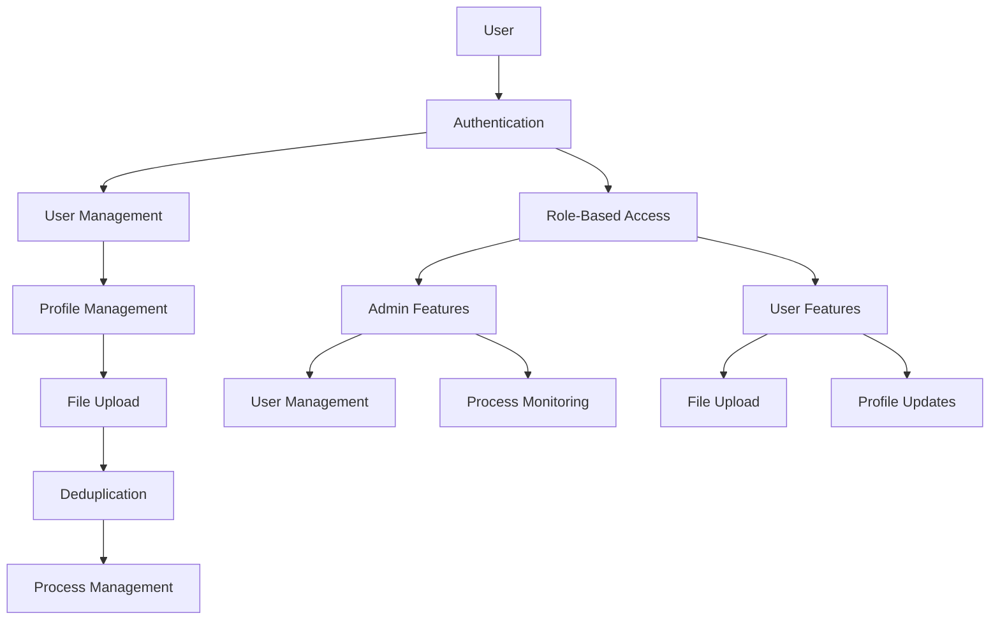
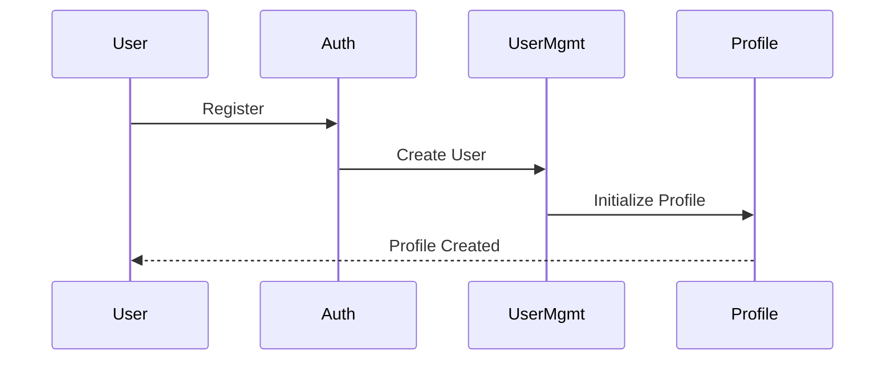
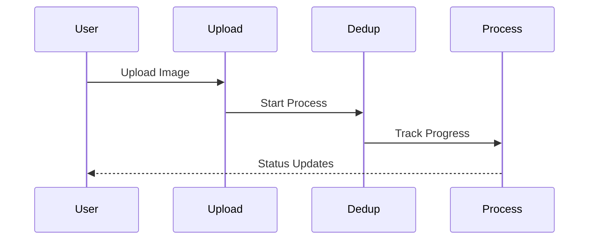
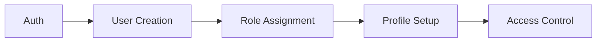
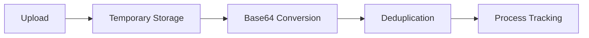
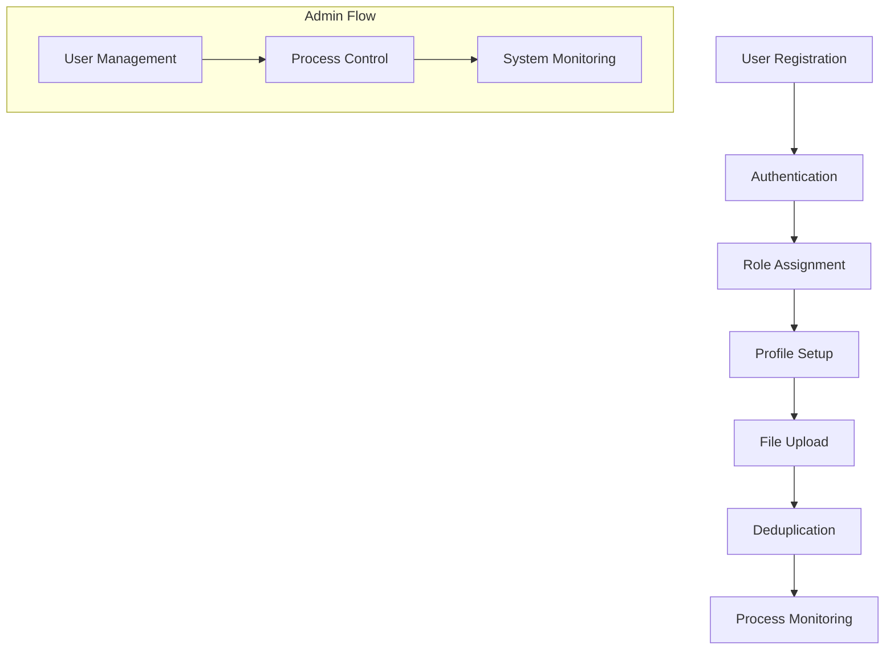
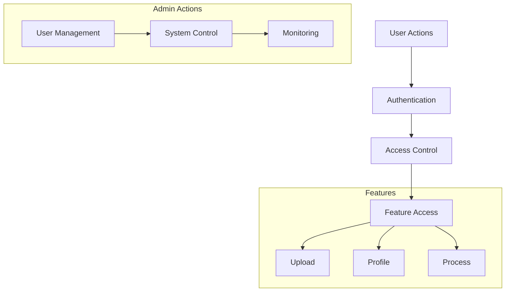
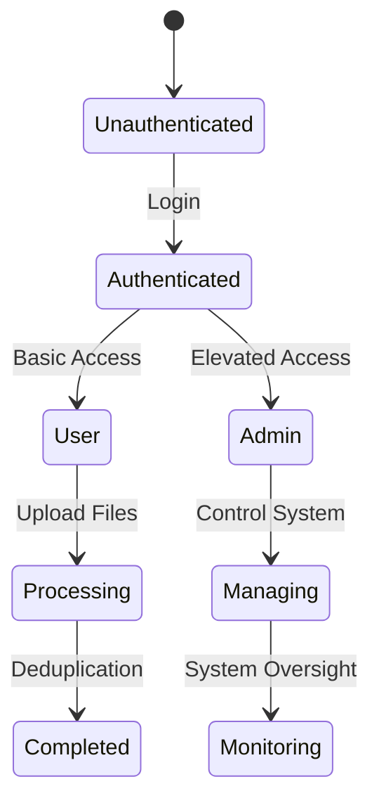
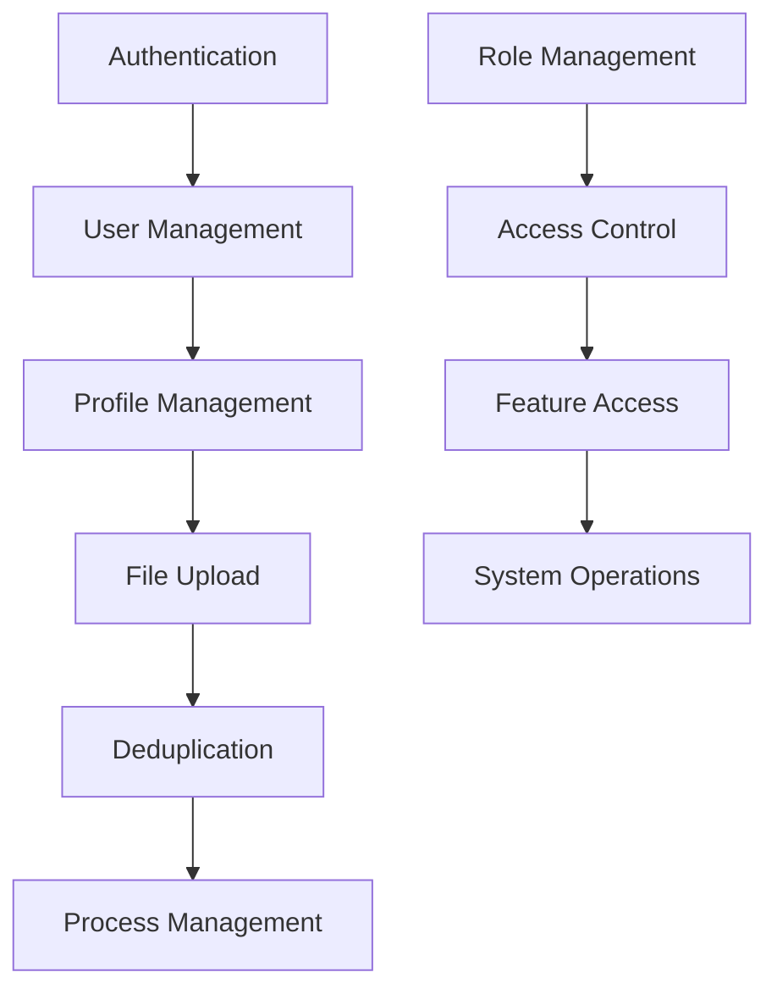

# System Flow Documentation

## Table of Contents

1. [System Overview](#system-overview)
2. [User Journey](#user-journey)
3. [Feature Interactions](#feature-interactions)
4. [Process Flows](#process-flows)

## System Overview

## User Journey

### 1. New User Registration Flow

### 2. File Processing Flow

## Feature Interactions

### 1. Authentication & User Management

### 2. File Processing & Deduplication

## Process Flows

### 1. Complete User Journey

### 2. System Operations

## Key Interactions

1. **Authentication to User Management**

   - User registration triggers profile creation
   - Role assignment determines feature access
   - Session management controls user state

2. **Upload to Deduplication**

   - File upload initiates deduplication process
   - Process tracking provides status updates
   - Results feed back to user interface

3. **Profile to System Access**
   - Profile information determines capabilities
   - Role-based access controls features
   - User status affects system interaction

## System States

## Feature Dependencies

