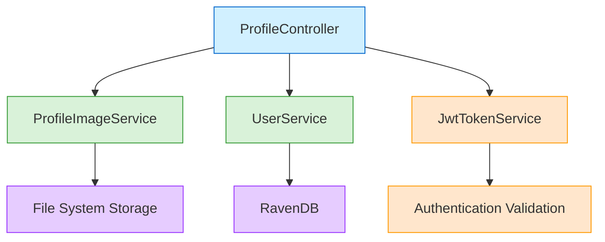
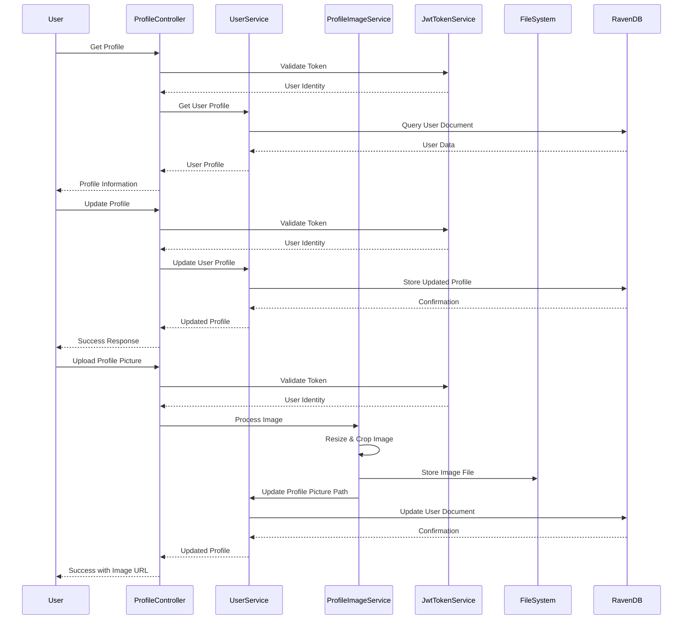
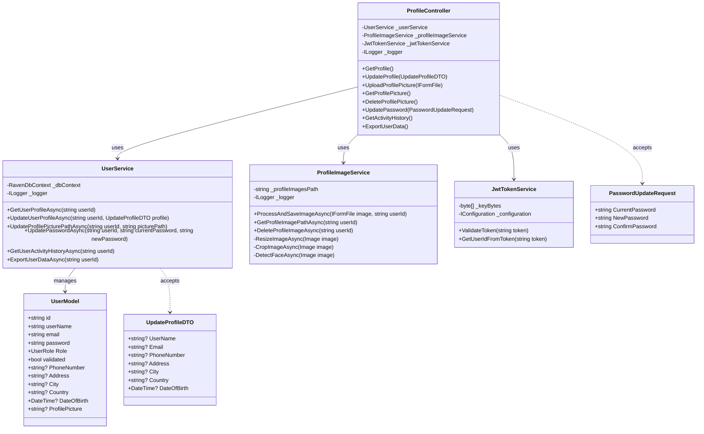

# User Profile Management Documentation

## Overview

The Profile Management system allows users to view and update their personal information, profile pictures, and account settings. It provides a comprehensive interface for managing user identity and preferences within the application.

## Use Case Diagram

```mermaid
graph TD
    subgraph Users
        RegularUser[Regular User]
        Admin[Administrator]
    end

    subgraph Profile Management
        ViewProfile[View Profile]
        UpdateProfile[Update Profile Information]
        ChangePassword[Change Password]
        ViewActivity[View Activity History]
    end

    subgraph Profile Picture
        UploadPicture[Upload Profile Picture]
        ViewPicture[View Profile Picture]
        DeletePicture[Delete Profile Picture]
    end

    subgraph Data Management
        ExportData[Export User Data]
        DeleteAccount[Delete Account]
    end

    RegularUser --> ViewProfile
    RegularUser --> UpdateProfile
    RegularUser --> ChangePassword
    RegularUser --> ViewActivity
    RegularUser --> UploadPicture
    RegularUser --> ViewPicture
    RegularUser --> DeletePicture
    RegularUser --> ExportData
    RegularUser --> DeleteAccount

    Admin --> ViewProfile
    Admin --> UpdateProfile
    Admin --> ChangePassword
    Admin --> ViewActivity
    Admin --> UploadPicture
    Admin --> ViewPicture
    Admin --> DeletePicture
    Admin --> ExportData

    classDef user fill:#d1f0ff,stroke:#0066cc
    classDef admin fill:#ffe6cc,stroke:#ff9900
    classDef profile fill:#d9f2d9,stroke:#339933
    classDef picture fill:#e6ccff,stroke:#9933ff
    classDef data fill:#ffe6e6,stroke:#cc0000

    class RegularUser user
    class Admin admin
    class ViewProfile,UpdateProfile,ChangePassword,ViewActivity profile
    class UploadPicture,ViewPicture,DeletePicture picture
    class ExportData,DeleteAccount data
```



## Features

- **Profile Information Management**: Update personal details including contact info and demographics
- **Profile Picture Handling**: Upload, crop, and manage profile images with secure storage
- **Account Settings**: Manage user preferences, notifications, and security settings
- **Data Export**: Download personal data in compliance with GDPR and privacy regulations
- **Activity History**: View login history and account activity for security monitoring

## Implementation Architecture



## Sequence Diagram



## Class Diagram



## API Endpoints

### Get User Profile

- **Endpoint:** `GET /api/profile`
- **Description:** Retrieves the current user's profile information
- **Authentication:** Required (JWT)
- **Response:** Complete user profile data
  ```json
  {
    "userId": "users/1-A",
    "username": "john_doe",
    "email": "john@example.com",
    "phoneNumber": "+1234567890",
    "address": "123 Main St",
    "city": "New York",
    "country": "USA",
    "dateOfBirth": "1990-01-01",
    "createdAt": "2023-01-15T10:30:00Z",
    "lastLoginAt": "2023-06-20T14:25:30Z",
    "profilePictureUrl": "/api/profile/images/user-1-A-20230620.jpg"
  }
  ```
- **Status Codes:**
  - 200: Profile retrieved successfully
  - 401: Unauthorized
  - 404: Profile not found

### Update Profile

- **Endpoint:** `PUT /api/profile`
- **Description:** Updates the user's profile information
- **Authentication:** Required (JWT)
- **Request Body:**
  ```json
  {
    "userName": "john_doe",
    "email": "john@example.com",
    "phoneNumber": "+1234567890",
    "address": "123 Main St",
    "city": "New York",
    "country": "USA",
    "dateOfBirth": "1990-01-01"
  }
  ```
- **Response:** Updated user profile data
  ```json
  {
    "userId": "users/1-A",
    "username": "john_doe",
    "email": "john@example.com",
    "phoneNumber": "+1234567890",
    "address": "123 Main St",
    "city": "New York",
    "country": "USA",
    "dateOfBirth": "1990-01-01",
    "profilePictureUrl": "/api/profile/images/user-1-A-20230620.jpg"
  }
  ```
- **Status Codes:**
  - 200: Profile updated successfully
  - 400: Invalid request data
  - 401: Unauthorized
  - 409: Email or username already in use

### Upload Profile Picture

- **Endpoint:** `POST /api/profile/picture`
- **Description:** Uploads or updates the user's profile picture
- **Authentication:** Required (JWT)
- **Request:** Multipart form data with image file
- **Response:** URL to access the profile picture
  ```json
  {
    "profilePictureUrl": "/api/profile/images/user-1-A-20230620.jpg"
  }
  ```
- **Status Codes:**
  - 200: Picture uploaded successfully
  - 400: Invalid image format or size
  - 401: Unauthorized
  - 500: File processing error

### Get Profile Picture

- **Endpoint:** `GET /api/profile/picture`
- **Description:** Retrieves the user's profile picture
- **Authentication:** Required (JWT)
- **Response:** Image file with appropriate content type
- **Status Codes:**
  - 200: Picture retrieved successfully
  - 404: No profile picture found

### Delete Profile Picture

- **Endpoint:** `DELETE /api/profile/picture`
- **Description:** Removes the user's profile picture
- **Authentication:** Required (JWT)
- **Response:** Confirmation of deletion
  ```json
  {
    "message": "Profile picture deleted successfully"
  }
  ```
- **Status Codes:**
  - 200: Picture deleted successfully
  - 401: Unauthorized
  - 404: No profile picture found

### Update Password

- **Endpoint:** `PUT /api/profile/password`
- **Description:** Updates the user's password
- **Authentication:** Required (JWT)
- **Request Body:**
  ```json
  {
    "currentPassword": "OldPassword123!",
    "newPassword": "NewPassword123!",
    "confirmPassword": "NewPassword123!"
  }
  ```
- **Response:** Confirmation of password update
  ```json
  {
    "message": "Password updated successfully"
  }
  ```
- **Status Codes:**
  - 200: Password updated successfully
  - 400: Invalid password format or mismatch
  - 401: Current password incorrect

### Get Login History

- **Endpoint:** `GET /api/profile/activity`
- **Description:** Retrieves user's login history and account activity
- **Authentication:** Required (JWT)
- **Response:** List of login events
  ```json
  {
    "activities": [
      {
        "timestamp": "2023-06-20T14:25:30Z",
        "action": "LOGIN",
        "ipAddress": "192.168.1.1",
        "device": "Chrome on Windows",
        "location": "New York, USA"
      },
      {
        "timestamp": "2023-06-15T09:12:45Z",
        "action": "PASSWORD_CHANGE",
        "ipAddress": "192.168.1.1",
        "device": "Chrome on Windows",
        "location": "New York, USA"
      }
    ]
  }
  ```
- **Status Codes:**
  - 200: Activity history retrieved successfully
  - 401: Unauthorized

### Export User Data

- **Endpoint:** `GET /api/profile/export`
- **Description:** Exports all user data in a portable format (GDPR compliance)
- **Authentication:** Required (JWT)
- **Response:** JSON file with all user data
- **Status Codes:**
  - 200: Data exported successfully
  - 401: Unauthorized

## Implementation Details

### Profile Data Management

- User profiles are stored in RavenDB with document IDs in format `users/{id}`
- Profile updates are validated against data constraints before storage
- Email address changes require verification similar to registration
- Profile history is maintained for audit and recovery purposes

### Profile Picture Processing

- Images are resized to standard dimensions (500x500 pixels)
- Images undergo automatic cropping to maintain aspect ratio
- Facial detection is used to center profile pictures on faces
- Supported formats: JPEG, PNG, WebP
- Maximum file size: 5MB
- Minimum dimensions: 200x200 pixels
- Images are stored in a dedicated `ProfileImages` directory with secure access controls
- File naming convention: `user-{userId}-{timestamp}.jpg`
- Old profile pictures are automatically deleted when replaced

### Security Implementation

- Personal data is encrypted at rest in the database
- Profile pictures are served via HTTPS only
- Access controls ensure users can only access their own profiles
- Audit logging tracks all profile changes with timestamps and IP addresses
- Profile API endpoints implement rate limiting to prevent abuse
- Input validation protects against injection attacks and malformed data

### Static File Service

- Profile images are served from a dedicated endpoint with proper content types
- Dynamic image resizing available through query parameters (width/height)
- Cache control headers prevent browser caching of profile images when updated
- Content-Disposition headers properly set for file downloads
- Direct file access is restricted through authorization middleware
- Images are served with appropriate CORS headers for frontend access

### Performance Considerations

- Profile data is cached to minimize database requests
- Profile images use optimized compression to balance quality and performance
- CDN-compatible URLs for profile images in production environments
- Image processing operations run in background tasks for large uploads
- Progressive image loading for slow connections

### Privacy Compliance

- User data export follows GDPR Article 20 requirements
- Data retention policies applied to all profile information
- Clear user interface for controlling data visibility and sharing
- Consent tracking for data processing operations
- Built-in mechanisms for data deletion requests
