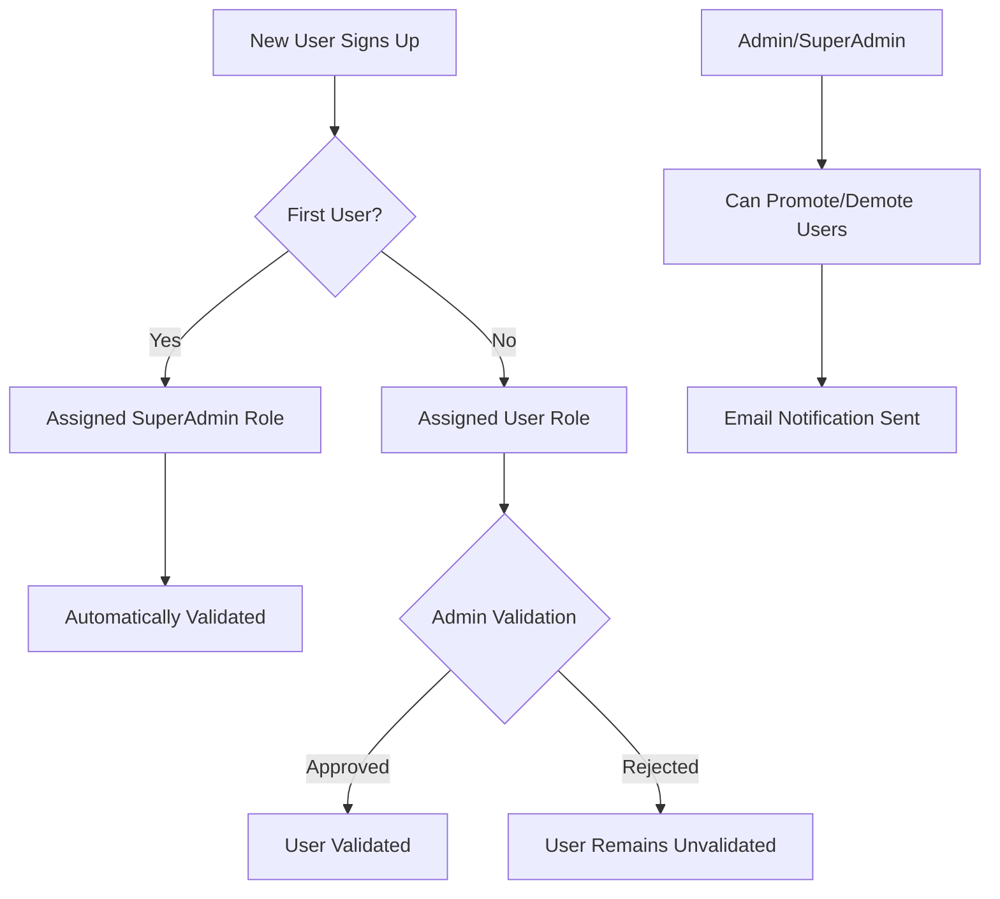
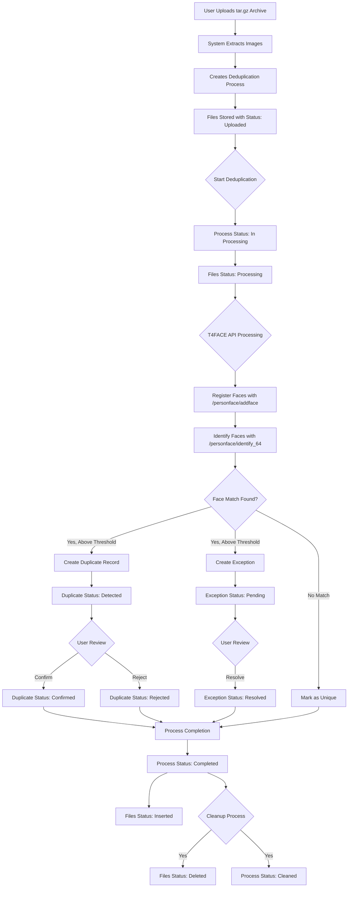
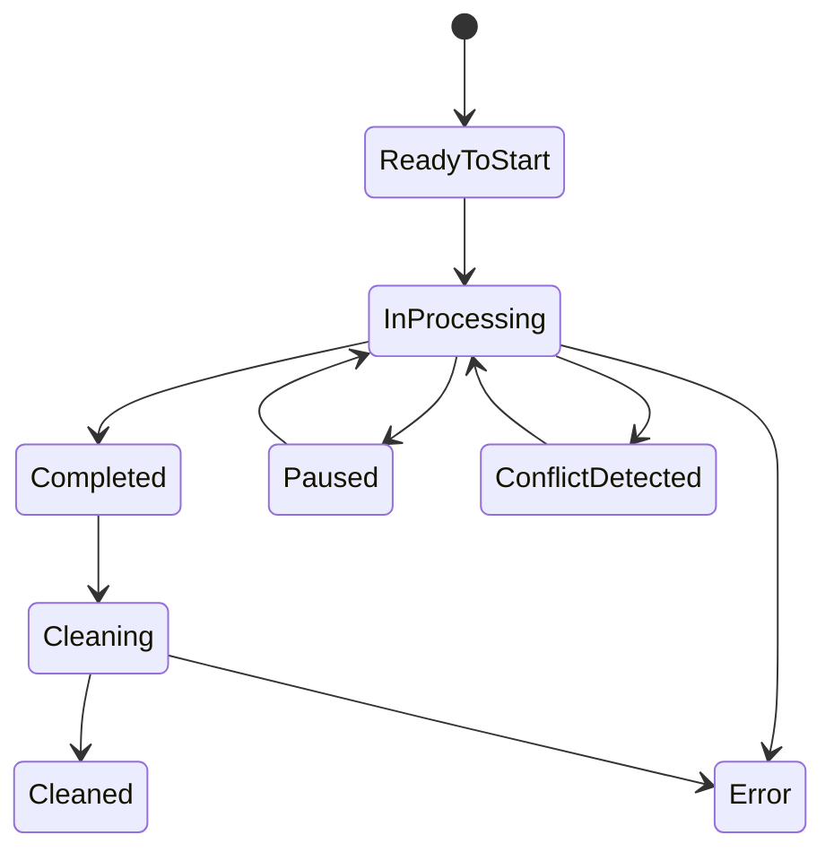
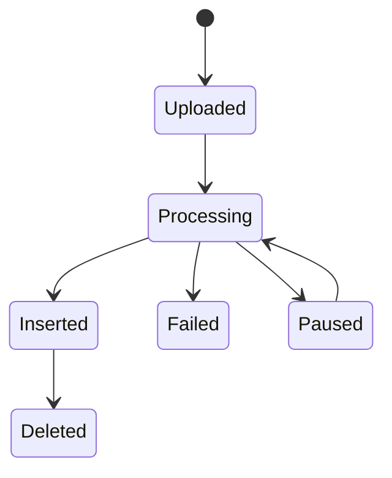
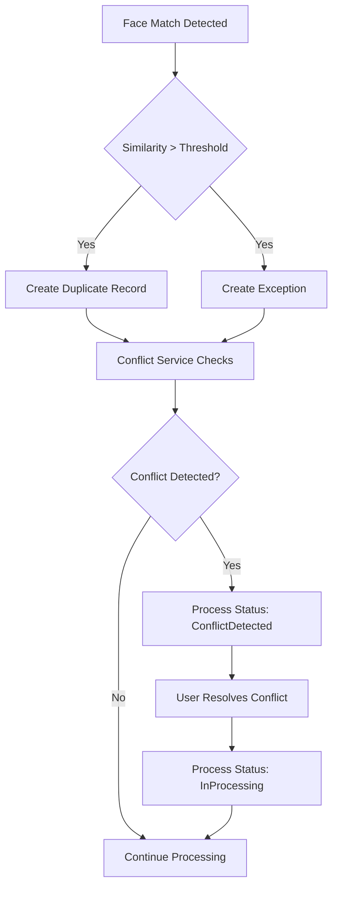
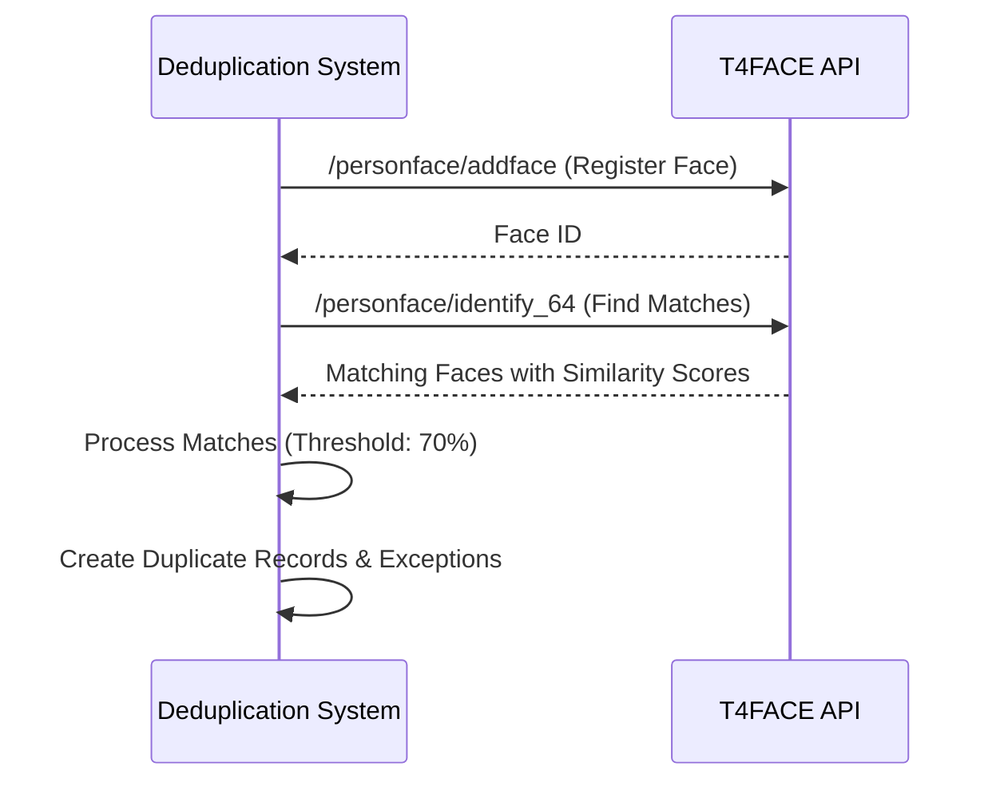
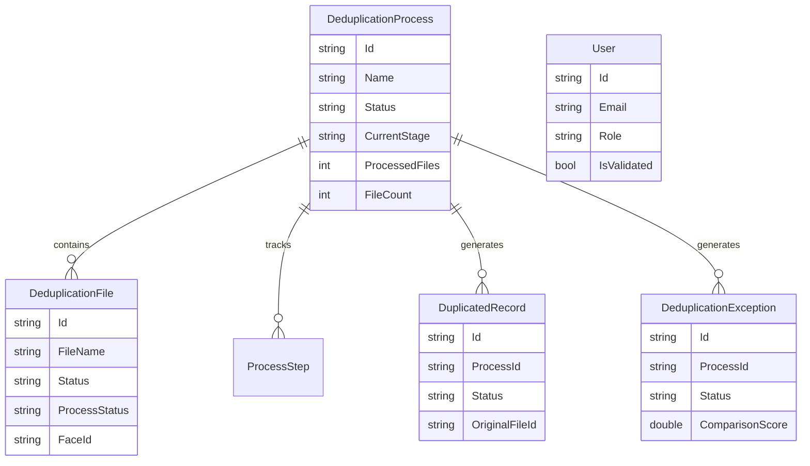
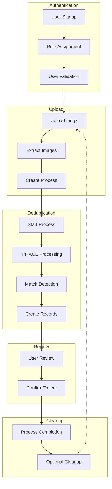

# Face Deduplication System Flow

## User Authentication Flow

## File Upload & Processing Flow

## Status Transitions

### Process Status Flow

### File Status Flow

## Conflict Resolution Flow

## T4FACE API Integration

## Database Structure

## Complete System Overview

