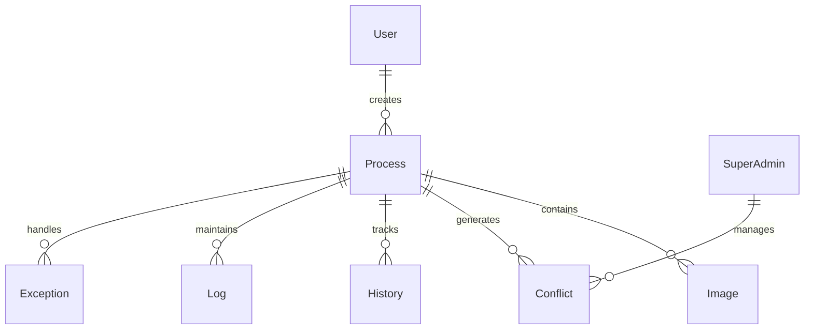
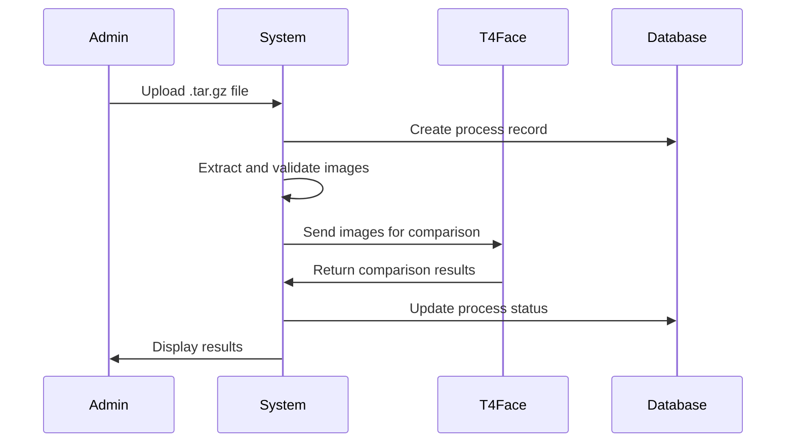

# Facial Recognition Deduplication System

## Table of Contents

1. [Project Overview](#project-overview)
2. [System Architecture](#system-architecture)
3. [Key Features](#key-features)
4. [API Documentation](#api-documentation)
5. [Technical Implementation](#technical-implementation)
6. [Security & Authentication](#security--authentication)
7. [Development Stack](#development-stack)
8. [Server Configuration](#server-configuration)
9. [Getting Started](#getting-started)

## Project Overview

This system is designed to handle biometric facial recognition and deduplication for a banking application. It provides secure access management through facial authentication while ensuring no duplicate facial records exist in the system.

## System Architecture

### Components

1. **Frontend**

   - User interface for process management
   - Real-time process monitoring
   - Visual feedback for deduplication results
   - Accessible at: `http://localhost:4200`

2. **Backend**

   - Process management and execution
   - Database operations
   - Integration with T4Face biometric service
   - Business logic implementation
   - Accessible at:
     - HTTP: `http://localhost:5148`
     - HTTPS: `https://localhost:7294`
   - Swagger UI: `https://localhost:7294/swagger`

3. **Database**

   - Process tracking
   - File management
   - Exception handling
   - Conflict resolution
   - Audit logging
   - RavenDB Community: `https://a.stage.ravendb.community`

4. **T4Face Service**
   - Facial recognition engine
   - Biometric matching
   - HTTP API integration

## Key Features

### 1. Authentication & Authorization

- JWT-based authentication
- Role-based access control (User/Admin/SuperAdmin)
- Google OAuth integration
- Password reset functionality
- Session management

### 2. User Management

- User registration and validation
- Profile management
- Role assignment and management
- User confirmation process
- User deletion (SuperAdmin only)

### 3. File Upload and Processing

- Support for image file uploads
- Base64 conversion
- Temporary file management
- Automatic cleanup
- Process tracking

### 4. Deduplication Process

- Background processing of facial images
- 1:N facial matching
- Conflict detection and management
- Real-time progress tracking
- Process status monitoring

### 5. Process Management

- Start/Pause/Resume operations
- Process prioritization
- Conflict resolution
- Cleanup operations
- Process history tracking

## API Documentation

### Authentication API

- Login/Logout
- Google OAuth
- Password reset
- Token management

### User Management API

- User registration
- Profile management
- Role management
- User confirmation

### Upload API

- File upload
- Temporary file management
- Base64 conversion

### Deduplication API

- Process initiation
- Process monitoring
- Status tracking
- Result retrieval

## Technical Implementation

### Database Schema



### Process Flow



## Security & Authentication

### Authentication Flow

1. User registration with role assignment
2. Email validation process
3. JWT token generation
4. Role-based access control
5. Session management

### Security Features

- HTTPS enforcement
- JWT token validation
- Role-based authorization
- Secure cookie management
- Input validation
- Exception handling

## Development Stack

- **Frontend**: Angular (Port: 4200)
- **Backend**: .NET Core (Ports: 5148 HTTP, 7294 HTTPS)
- **Database**: RavenDB Community
- **CI/CD**: Azure DevOps
- **Hosting**: Azure

## Server Configuration

### Port Configuration

```json
"Server": {
  "HttpPort": 5148,
  "HttpsPort": 7294
}
```

### Access Points

1. **Backend API**

   - HTTP: `http://localhost:5148`
   - HTTPS: `https://localhost:7294`
   - Swagger UI: `https://localhost:7294/swagger`

2. **Frontend Application**

   - URL: `http://localhost:4200`

3. **Database**
   - URL: `https://a.stage.ravendb.community`

## Getting Started

### Prerequisites

- .NET Core SDK
- Node.js and npm
- RavenDB Community
- T4Face service access

### Installation

1. Clone the repository
2. Configure environment variables
3. Set up database connection
4. Install dependencies
5. Start the application

### Configuration

- Update `appsettings.json` with your settings
- Configure JWT secret key
- Set up email service credentials
- Configure database connection

### Running the Application

1. Start the backend server
2. Start the frontend application
3. Access the application through the configured URLs

## Documentation Structure

### Core Documentation

- [Auth.md](Auth.md): Authentication and authorization
- [UserManagement.md](UserManagement.md): User management features
- [Uploading.md](Uploading.md): File upload and processing
- [Deduplication.md](Deduplication.md): Deduplication process
- [Profile.md](Profile.md): User profile management

### Additional Resources

- API documentation
- Security guidelines
- Deployment procedures
- Troubleshooting guide
