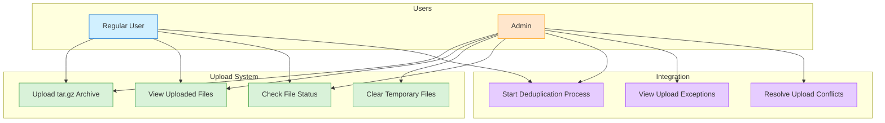
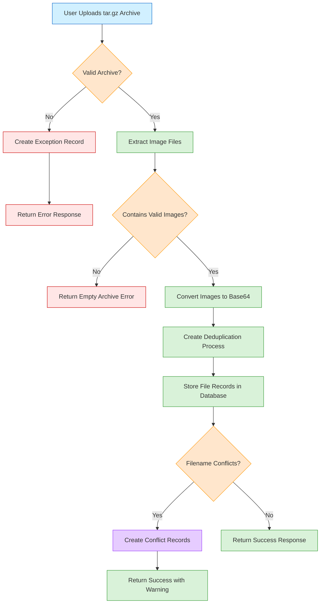
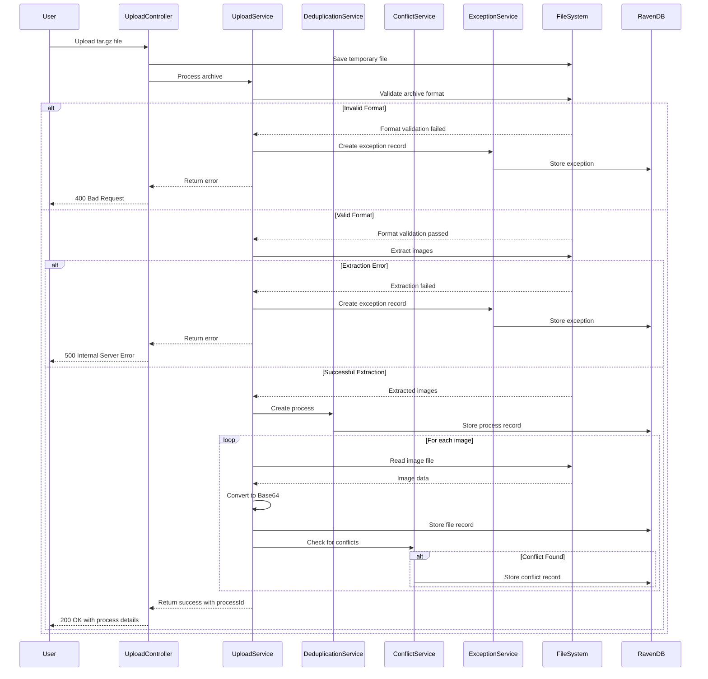
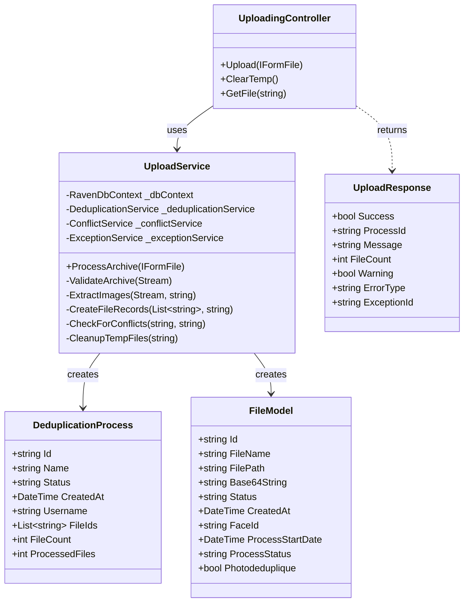

# Upload System Documentation

## Overview

The Upload System handles the uploading, validation, and processing of tar.gz archives containing images for deduplication. It provides robust error handling, validation, and integration with the exception tracking system.

## Use Case Diagram



## Supported File Types

Currently, the system only supports **tar.gz** archives containing image files (JPG, JPEG, PNG).

## Upload Process Flow



## Sequence Diagram



## Class Diagram



## Upload Process

1. **File Validation**

   - The system validates that the uploaded file is a tar.gz archive
   - It checks the file header to ensure it's a valid gzip format
   - It verifies the file size is appropriate

2. **Extraction**

   - The system extracts all image files from the archive
   - Non-image files are skipped
   - Each extracted image is converted to Base64 for storage and processing

3. **Process Creation**

   - A new deduplication process is created for the upload
   - Each extracted file is associated with this process
   - File records are stored in the Files database

4. **Conflict Detection**

   - The system checks for filename conflicts with existing files
   - If conflicts are found, they are recorded and flagged

5. **Response**
   - The system returns the process ID and status information
   - For successful uploads, it provides file counts and next steps
   - For failed uploads, it provides detailed error information

## Error Handling

The system provides comprehensive error handling for various failure scenarios:

### Invalid File Format

If the uploaded file is not a valid tar.gz archive, the system:

- Creates an exception record with type "Invalid Archive Format"
- Returns a 400 Bad Request response with detailed error information
- Cleans up any temporary files created during the process

### Corrupted Archive

If the uploaded file is a tar.gz archive but is corrupted, the system:

- Creates an exception record with type "Corrupted Archive"
- Returns a 400 Bad Request response with detailed error information
- Includes the specific error details from the extraction attempt
- Cleans up any temporary files created during the process

### Extraction Errors

If any errors occur during the extraction process, the system:

- Creates an exception record with type "Archive Extraction Error"
- Records detailed information about the error for troubleshooting
- Returns a 500 Internal Server Error response with error details
- Cleans up any temporary files created during the process

### Empty Archives

If the archive contains no valid image files, the system:

- Returns a 400 Bad Request response indicating no valid images were found
- Cleans up any temporary files created during the process

## API Endpoints

### POST /api/Uploading/upload

Uploads and processes a tar.gz archive containing images.

**Request:**

- Content-Type: multipart/form-data
- Body: Form data with a "file" field containing the tar.gz archive

**Successful Response (200 OK):**

```json
{
  "success": true,
  "processId": "processes/9ed279ae-f516-4816-ab1a-67274869cd5c",
  "message": "Successfully uploaded and extracted 10 files. Process is ready to start.",
  "fileCount": 10,
  "warning": false
}
```

**Error Response (400 Bad Request) - Invalid Format:**

```json
{
  "success": false,
  "message": "The uploaded file is not a valid tar.gz archive. Please check the file and try again.",
  "errorType": "InvalidArchiveFormat",
  "processId": "processes/9ed279ae-f516-4816-ab1a-67274869cd5c",
  "exceptionId": "Exceptions/9ed279ae-f516-4816-ab1a-67274869cd5c"
}
```

**Error Response (400 Bad Request) - Corrupted Archive:**

```json
{
  "success": false,
  "message": "The uploaded file is corrupted or not a valid tar.gz archive",
  "errorType": "CorruptedArchive",
  "processId": "processes/9ed279ae-f516-4816-ab1a-67274869cd5c",
  "exceptionId": "Exceptions/9ed279ae-f516-4816-ab1a-67274869cd5c"
}
```

**Error Response (500 Internal Server Error) - Extraction Error:**

```json
{
  "success": false,
  "message": "Error extracting tar.gz file: [specific error message]",
  "processId": "processes/9ed279ae-f516-4816-ab1a-67274869cd5c",
  "exceptionId": "Exceptions/9ed279ae-f516-4816-ab1a-67274869cd5c"
}
```

### POST /api/Uploading/clear-temp

Clears temporary files created during the upload process.

**Request:**

- No parameters required

**Response (200 OK):**

```json
{
  "message": "Temp folders cleared successfully."
}
```

### GET /api/Uploading/file/{fileId}

Retrieves a specific file by ID.

**Request:**

- Path Parameter: fileId - The ID of the file to retrieve

**Response (200 OK):**

```json
{
  "id": "files/ac71e460-0334-465a-962d-c99ae5d9e3be",
  "fileName": "image1.jpg",
  "filePath": "TempFiles/9ed279ae-f516-4816-ab1a-67274869cd5c/image1.jpg",
  "base64String": "[base64-encoded image data]",
  "status": "Uploaded",
  "createdAt": "2025-04-29T21:22:18.5733552Z"
}
```

## Best Practices

1. **File Preparation**

   - Ensure tar.gz archives are properly created and not corrupted
   - Include only image files (JPG, JPEG, PNG) in the archive
   - Keep file sizes reasonable (under 10MB per image is recommended)

2. **Error Handling**

   - Always check the "success" field in the response
   - Handle different error types appropriately in the client application
   - Display meaningful error messages to users

3. **Process Management**
   - After a successful upload, use the returned processId to start the deduplication process
   - Monitor the process status using the Deduplication API endpoints
   - Handle any conflicts that may be detected during the upload

## Integration with Exception System

All errors during the upload process are recorded in the Exception system, allowing administrators to:

- Track and monitor upload failures
- Identify patterns in file corruption or invalid formats
- Provide better support to users experiencing upload issues

Exceptions can be viewed and managed through the Exception API endpoints.
