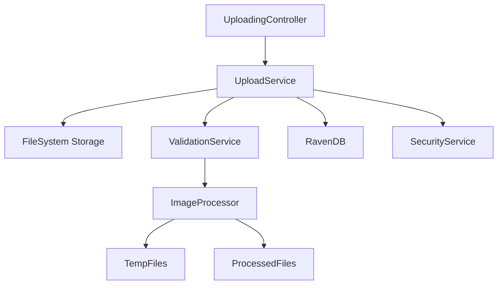
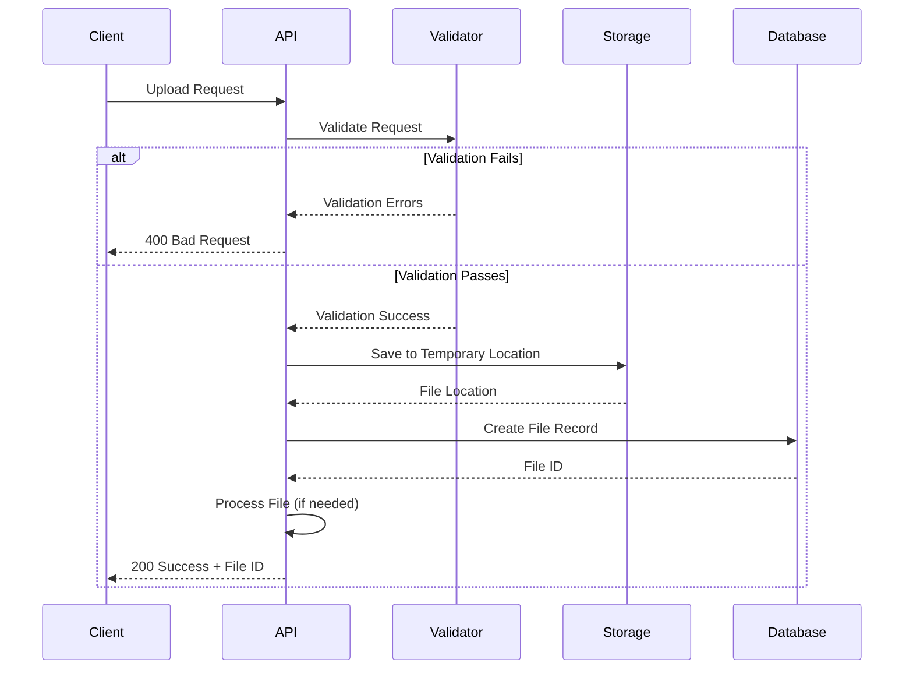

# File Upload System Documentation

## Overview

The File Upload system enables secure uploading, storage, and management of files for deduplication processing. It handles various file formats, implements validation, and provides status tracking for uploaded files while ensuring data security and integrity throughout the process.

## System Architecture



## Features

- **Secure File Upload**: Encrypted transmission and storage with integrity verification
- **Format Validation**: Comprehensive verification of file types, content, and metadata
- **Size Limitations**: Configurable limits per file type with quota management
- **Batch Upload**: Support for multiple files in a single request with transaction handling
- **Status Tracking**: Real-time monitoring of processing status with WebSocket updates
- **Temporary Storage**: Managed lifecycle for files during processing phases
- **File Transformation**: Image normalization, format conversion, and optimization

## Upload Process Flow



## API Endpoints

### Upload Single File

- **Endpoint:** `POST /api/upload/file`
- **Description:** Uploads a single file to the system
- **Authentication:** Required (JWT)
- **Request:** Multipart form data with file
  - Form Field: `file` - The file to upload
  - Form Field: `description` (optional) - File description
  - Form Field: `tags` (optional) - Comma-separated tags
- **Response:** File ID and status
  ```json
  {
    "fileId": "files/1-A",
    "fileName": "profile.jpg",
    "contentType": "image/jpeg",
    "sizeInBytes": 125000,
    "uploadedAt": "2023-06-21T09:35:00Z",
    "status": "ready",
    "thumbnailUrl": "/api/files/thumbnail/files/1-A"
  }
  ```
- **Status Codes:**
  - 200: File uploaded successfully
  - 400: Invalid file format or size
  - 401: Unauthorized
  - 413: File too large
  - 507: Insufficient storage

### Upload Multiple Files

- **Endpoint:** `POST /api/upload/files`
- **Description:** Uploads multiple files in a single request
- **Authentication:** Required (JWT)
- **Request:** Multipart form data with files array
  - Form Field: `files[]` - Array of files to upload
  - Form Field: `description` (optional) - Common description
  - Form Field: `preserveFilenames` (optional) - Boolean to keep original filenames
- **Response:** Array of file IDs and statuses
  ```json
  {
    "succeeded": [
      {
        "fileId": "files/1-A",
        "fileName": "profile1.jpg",
        "contentType": "image/jpeg",
        "sizeInBytes": 125000,
        "status": "ready"
      },
      {
        "fileId": "files/2-A",
        "fileName": "profile2.jpg",
        "contentType": "image/jpeg",
        "sizeInBytes": 150000,
        "status": "ready"
      }
    ],
    "failed": [
      {
        "fileName": "document.exe",
        "error": "Unsupported file type"
      }
    ],
    "totalUploaded": 2,
    "totalFailed": 1,
    "batchId": "batch/2023-06-21/1"
  }
  ```
- **Status Codes:**
  - 200: Files processed (some may have failed)
  - 400: No files provided or all files invalid
  - 401: Unauthorized
  - 413: Batch size too large

### Upload Base64 File

- **Endpoint:** `POST /api/upload/base64`
- **Description:** Uploads a file encoded as base64 string
- **Authentication:** Required (JWT)
- **Request Body:**
  ```json
  {
    "fileData": "data:image/jpeg;base64,/9j/4AAQSkZJRg...",
    "fileName": "profile.jpg",
    "fileType": "image/jpeg",
    "description": "User profile picture"
  }
  ```
- **Response:** File ID and status
  ```json
  {
    "fileId": "files/3-A",
    "fileName": "profile.jpg",
    "contentType": "image/jpeg",
    "sizeInBytes": 132456,
    "uploadedAt": "2023-06-21T09:40:00Z",
    "status": "ready",
    "thumbnailUrl": "/api/files/thumbnail/files/3-A"
  }
  ```
- **Status Codes:**
  - 200: File uploaded successfully
  - 400: Invalid base64 data or format
  - 401: Unauthorized
  - 413: Decoded file too large

### Get File Status

- **Endpoint:** `GET /api/upload/status/{fileId}`
- **Description:** Checks the processing status of an uploaded file
- **Authentication:** Required (JWT)
- **Response:** Current file status and metadata
  ```json
  {
    "fileId": "files/1-A",
    "fileName": "profile.jpg",
    "contentType": "image/jpeg",
    "sizeInBytes": 125000,
    "uploadedAt": "2023-06-21T09:35:00Z",
    "status": "ready",
    "processingProgress": 100,
    "availableOperations": ["view", "download", "delete"],
    "metadata": {
      "width": 800,
      "height": 600,
      "hasExif": true,
      "createdOn": "2023-06-20T15:30:00Z"
    }
  }
  ```
- **Status Codes:**
  - 200: Status retrieved successfully
  - 401: Unauthorized
  - 404: File not found

### Get File Information

- **Endpoint:** `GET /api/upload/file/{fileId}`
- **Description:** Retrieves detailed information about an uploaded file
- **Authentication:** Required (JWT)
- **Response:** Complete file metadata
  ```json
  {
    "fileId": "files/1-A",
    "fileName": "profile.jpg",
    "originalFileName": "my_profile_pic.jpg",
    "contentType": "image/jpeg",
    "sizeInBytes": 125000,
    "uploadedAt": "2023-06-21T09:35:00Z",
    "uploadedBy": "users/1-A",
    "status": "ready",
    "path": "TempFiles/2023/06/21/1687337700_profile.jpg",
    "md5Hash": "a1b2c3d4e5f6a1b2c3d4e5f6a1b2c3d4",
    "metadata": {
      "width": 800,
      "height": 600,
      "colorSpace": "sRGB",
      "hasExif": true,
      "exifData": {
        "make": "Canon",
        "model": "EOS 5D Mark IV",
        "createDate": "2023-06-20T15:30:00Z"
      }
    },
    "processingHistory": [
      {
        "operation": "upload",
        "timestamp": "2023-06-21T09:35:00Z",
        "status": "success"
      },
      {
        "operation": "validation",
        "timestamp": "2023-06-21T09:35:01Z",
        "status": "success"
      },
      {
        "operation": "thumbnail-generation",
        "timestamp": "2023-06-21T09:35:02Z",
        "status": "success"
      }
    ]
  }
  ```
- **Status Codes:**
  - 200: File information retrieved successfully
  - 401: Unauthorized
  - 404: File not found

### Download File

- **Endpoint:** `GET /api/upload/download/{fileId}`
- **Description:** Downloads the original file
- **Authentication:** Required (JWT)
- **Query Parameters:**
  - disposition: Content disposition (inline/attachment, default: attachment)
- **Response:** File content with appropriate headers
- **Status Codes:**
  - 200: File downloaded successfully
  - 401: Unauthorized
  - 404: File not found

### Delete File

- **Endpoint:** `DELETE /api/upload/file/{fileId}`
- **Description:** Removes a file from the system
- **Authentication:** Required (JWT)
- **Query Parameters:**
  - permanent: Boolean flag for permanent deletion (default: false)
- **Response:** Confirmation of deletion
  ```json
  {
    "fileId": "files/1-A",
    "deletedAt": "2023-06-21T10:15:00Z",
    "deletionType": "soft",
    "canRestore": true,
    "restoreUntil": "2023-06-28T10:15:00Z"
  }
  ```
- **Status Codes:**
  - 200: File deleted successfully
  - 401: Unauthorized
  - 404: File not found
  - 409: File in use by active process

## Implementation Details

### File Storage Structure

- **Temporary Storage**: Files initially stored in "TempFiles" directory
  - Path format: `TempFiles/YYYY/MM/DD/timestamp_filename.ext`
  - Automatic folder creation with appropriate permissions
  - Separate folders per day for better organization
- **Permanent Storage**: Processed files moved to appropriate directories
  - Path format: `ProcessedFiles/YYYY/MM/DD/fileId.ext`
  - Optimized for quick retrieval and backup
- **Directory Structure**: Organized by user ID and upload date
  - User isolation for security and organization
  - Date-based structure for efficient cleanup operations
- **Cleanup Process**: Automatic removal of temporary files
  - Background job runs daily to clean up expired temporary files
  - Configurable retention periods (default: 24 hours)
  - Soft deletion with recycle bin concept

### Supported File Types

- **Images**: JPEG, PNG, BMP, WEBP, TIFF
  - Maximum dimensions: 5000x5000 pixels
  - Color profile handling: sRGB preferred, other profiles converted
  - Metadata preservation options
- **Maximum File Sizes**:
  - Images: 10MB per file
  - Total batch upload: 50MB
  - User quota: Configurable per role
- **Validation Rules**:
  - MIME type verification (not just file extension)
  - Content type analysis
  - Malware scanning (optional integration)
  - Filename sanitization

### File Processing Pipeline

1. **Upload**: File received and validated
   - File size check
   - MIME type verification
   - Malformed file detection
2. **Storage**: File saved to temporary storage
   - Filename normalization
   - Path generation
   - File metadata extraction
3. **Virus Scan**: File checked for malware (if configured)
   - Integration with ClamAV or similar
   - Quarantine for suspicious files
4. **Processing**: File prepared for deduplication
   - Image format normalization
   - Thumbnail generation
   - EXIF data handling (optional stripping)
5. **Completion**: File moved to permanent storage or kept in temporary location
   - Database record updated
   - Original file metadata preserved
   - Event triggered for downstream processes

### Security Considerations

- Files are scanned for viruses before processing using ClamAV integration
- Content validation ensures only permitted file types with deep inspection
- Storage paths use randomization and avoid user input to prevent directory traversal attacks
- Rate limiting prevents upload flooding (configurable per user/role)
- Temporary files auto-expire after 24 hours with secure deletion
- All file operations are logged for audit purposes with detailed tracking
- Files are stored with restrictive permissions (read-only for web server)
- Filenames are sanitized to prevent injection attacks and invalid characters
- Content-Type verification prevents MIME type spoofing

### Performance Optimization

- Large file uploads use streaming to minimize memory usage
  - Chunked transfer encoding
  - Progressive file handling
- Files are processed asynchronously to improve response times
  - Background workers handle file processing tasks
  - WebSocket notifications for completion
- Temporary files are stored on fast local storage for processing
  - SSD-backed storage for active files
  - Potential migration to object storage for archival
- Image resizing and thumbnail generation uses optimized libraries
  - Server-side caching of generated thumbnails
  - On-demand processing with result caching
- Parallel processing for batch uploads
  - Configurable thread pool
  - Priority queue for processing tasks

### High Availability and Scalability

- File storage supports distributed deployment
  - Shared network storage or distributed file system
  - Object storage compatibility (S3-compatible)
- Database records synchronized with file operations
- Transaction support prevents orphaned files or database records
- Failover handling with automatic retry
- Horizontal scaling through stateless service design
