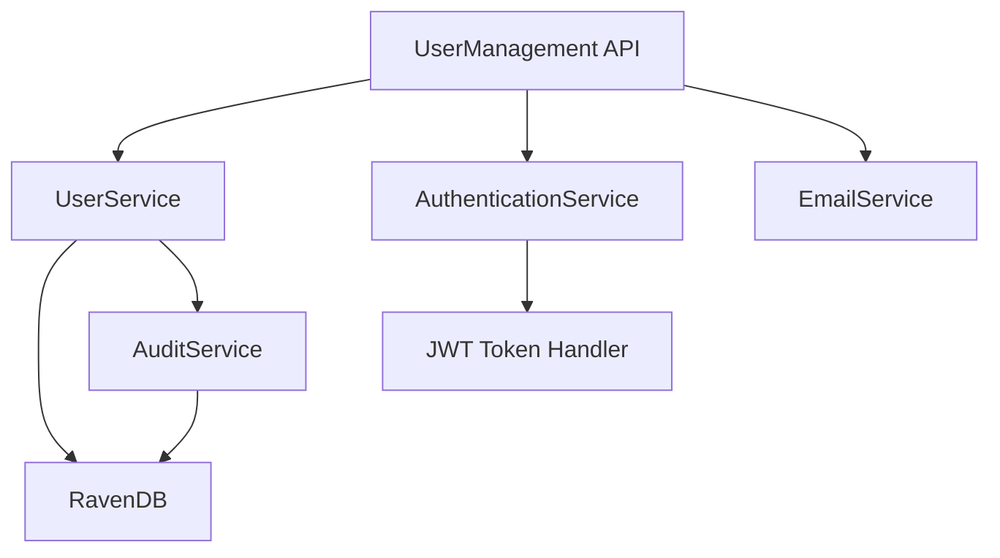

# User Management System Documentation

## Overview

The User Management system provides comprehensive tools for administering user accounts, managing roles and permissions, and monitoring user activity within the application. It serves as the central administrative component for managing user access and system permissions.

## System Architecture



## Features

- **User Administration**: Create, read, update, delete (CRUD) user accounts with comprehensive validation
- **Role Management**: Assign, modify, and enforce role-based permissions throughout the system
- **User Search**: Find users by various criteria including partial matches and filters
- **Account Status**: Activate, deactivate, suspend, or permanently delete accounts with proper data handling
- **Audit Logging**: Track user creation, modifications, role changes, and administrative actions
- **Batch Operations**: Perform actions on multiple users simultaneously with transaction support
- **Import/Export**: Bulk import users from CSV/Excel files and export user data reports

## Roles and Permissions

- **User (0)**: Standard access to personal features
  - Manage own profile
  - Run deduplication processes
  - View personal results
- **Admin (1)**: Manage users and content
  - Create/edit regular users
  - View all deduplication processes
  - Manage conflicts
  - Access reporting
- **SuperAdmin (2)**: Full system access and configuration
  - Manage all users including admins
  - Configure system settings
  - Access audit logs
  - Manage role definitions

## API Endpoints

### Get All Users

- **Endpoint:** `GET /api/users`
- **Description:** Retrieves a paginated list of all users
- **Authentication:** Required (JWT, Admin or SuperAdmin role)
- **Query Parameters:**
  - page: Page number (default: 1)
  - pageSize: Items per page (default: 10)
  - search: Search term for filtering
  - role: Filter by role (0, 1, 2)
  - status: Filter by account status (active, inactive, pending)
  - sortBy: Field to sort by (username, email, createdAt, etc.)
  - sortOrder: Sort direction (asc, desc)
- **Response:** Paginated list of users with metadata
  ```json
  {
    "users": [
      {
        "userId": "users/1-A",
        "username": "john_doe",
        "email": "john@example.com",
        "role": 0,
        "isActive": true,
        "isValidated": true,
        "createdAt": "2023-01-15T10:30:00Z",
        "lastLoginAt": "2023-06-20T14:25:30Z"
      },
      {
        "userId": "users/2-A",
        "username": "jane_smith",
        "email": "jane@example.com",
        "role": 1,
        "isActive": true,
        "isValidated": true,
        "createdAt": "2023-02-10T09:15:00Z",
        "lastLoginAt": "2023-06-19T11:45:20Z"
      }
    ],
    "pagination": {
      "currentPage": 1,
      "pageSize": 10,
      "totalItems": 42,
      "totalPages": 5
    }
  }
  ```
- **Status Codes:**
  - 200: Users retrieved successfully
  - 401: Unauthorized
  - 403: Insufficient permissions

### Get User by ID

- **Endpoint:** `GET /api/users/{userId}`
- **Description:** Retrieves detailed information about a specific user
- **Authentication:** Required (JWT, Admin or SuperAdmin role)
- **Response:** Complete user information
  ```json
  {
    "userId": "users/1-A",
    "username": "john_doe",
    "email": "john@example.com",
    "role": 0,
    "isActive": true,
    "isValidated": true,
    "phoneNumber": "+1234567890",
    "address": "123 Main St",
    "city": "New York",
    "country": "USA",
    "dateOfBirth": "1990-01-01",
    "createdAt": "2023-01-15T10:30:00Z",
    "lastLoginAt": "2023-06-20T14:25:30Z",
    "createdBy": "users/admin-1"
  }
  ```
- **Status Codes:**
  - 200: User retrieved successfully
  - 401: Unauthorized
  - 403: Insufficient permissions
  - 404: User not found

### Create User

- **Endpoint:** `POST /api/users`
- **Description:** Creates a new user account (administrative function)
- **Authentication:** Required (JWT, Admin or SuperAdmin role)
- **Request Body:**
  ```json
  {
    "username": "new_user",
    "email": "newuser@example.com",
    "password": "Password123!",
    "confirmPassword": "Password123!",
    "role": 0,
    "isValidated": true,
    "phoneNumber": "+1234567890",
    "sendWelcomeEmail": true
  }
  ```
- **Response:** Created user information
  ```json
  {
    "userId": "users/3-A",
    "username": "new_user",
    "email": "newuser@example.com",
    "role": 0,
    "isActive": true,
    "isValidated": true,
    "createdAt": "2023-06-21T12:00:00Z"
  }
  ```
- **Status Codes:**
  - 201: User created successfully
  - 400: Invalid request data
  - 401: Unauthorized
  - 403: Insufficient permissions
  - 409: Email or username already exists

### Update User

- **Endpoint:** `PUT /api/users/{userId}`
- **Description:** Updates a user's information
- **Authentication:** Required (JWT, Admin or SuperAdmin role)
- **Request Body:**
  ```json
  {
    "username": "updated_user",
    "email": "updated@example.com",
    "role": 1,
    "isValidated": true,
    "phoneNumber": "+1234567890",
    "address": "456 New St",
    "city": "Boston",
    "country": "USA"
  }
  ```
- **Response:** Updated user information
  ```json
  {
    "userId": "users/1-A",
    "username": "updated_user",
    "email": "updated@example.com",
    "role": 1,
    "isActive": true,
    "isValidated": true,
    "phoneNumber": "+1234567890",
    "address": "456 New St",
    "city": "Boston",
    "country": "USA",
    "lastModifiedAt": "2023-06-21T14:30:00Z",
    "lastModifiedBy": "users/admin-1"
  }
  ```
- **Status Codes:**
  - 200: User updated successfully
  - 400: Invalid request data
  - 401: Unauthorized
  - 403: Insufficient permissions
  - 404: User not found
  - 409: Email or username already exists

### Delete User

- **Endpoint:** `DELETE /api/users/{userId}`
- **Description:** Removes a user from the system
- **Authentication:** Required (JWT, Admin or SuperAdmin role)
- **Query Parameters:**
  - hardDelete: Boolean flag for permanent deletion (default: false)
- **Response:** Confirmation of deletion
  ```json
  {
    "message": "User deleted successfully",
    "deletionType": "soft"
  }
  ```
- **Status Codes:**
  - 200: User deleted successfully
  - 401: Unauthorized
  - 403: Insufficient permissions
  - 404: User not found

### Change User Role

- **Endpoint:** `PATCH /api/users/{userId}/role`
- **Description:** Updates a user's role
- **Authentication:** Required (JWT, SuperAdmin role only)
- **Request Body:**
  ```json
  {
    "role": 1,
    "reason": "Promotion to admin duties"
  }
  ```
- **Response:** Updated user role information
  ```json
  {
    "userId": "users/1-A",
    "username": "john_doe",
    "previousRole": 0,
    "newRole": 1,
    "changedAt": "2023-06-21T15:45:00Z",
    "changedBy": "users/superadmin-1"
  }
  ```
- **Status Codes:**
  - 200: Role updated successfully
  - 400: Invalid role value
  - 401: Unauthorized
  - 403: Insufficient permissions
  - 404: User not found
  - 409: Cannot change own role

### Activate/Deactivate User

- **Endpoint:** `PATCH /api/users/{userId}/status`
- **Description:** Changes a user's active status
- **Authentication:** Required (JWT, Admin or SuperAdmin role)
- **Request Body:**
  ```json
  {
    "isActive": false,
    "reason": "Account suspended due to inactivity"
  }
  ```
- **Response:** Updated user status
  ```json
  {
    "userId": "users/1-A",
    "username": "john_doe",
    "isActive": false,
    "statusChangedAt": "2023-06-21T16:00:00Z",
    "statusChangedBy": "users/admin-1"
  }
  ```
- **Status Codes:**
  - 200: Status updated successfully
  - 401: Unauthorized
  - 403: Insufficient permissions
  - 404: User not found
  - 409: Cannot deactivate own account

### Bulk User Operations

- **Endpoint:** `POST /api/users/bulk`
- **Description:** Performs operations on multiple users
- **Authentication:** Required (JWT, Admin or SuperAdmin role)
- **Request Body:**
  ```json
  {
    "operation": "deactivate",
    "userIds": ["users/1-A", "users/2-A", "users/3-A"],
    "reason": "Organizational restructuring"
  }
  ```
- **Response:** Operation result summary
  ```json
  {
    "successful": 2,
    "failed": 1,
    "errors": [
      {
        "userId": "users/3-A",
        "reason": "User not found"
      }
    ]
  }
  ```
- **Status Codes:**
  - 200: Operation completed
  - 401: Unauthorized
  - 403: Insufficient permissions

### Import Users

- **Endpoint:** `POST /api/users/import`
- **Description:** Imports multiple users from CSV or Excel file
- **Authentication:** Required (JWT, Admin or SuperAdmin role)
- **Request:** Multipart form data with file
- **Response:** Import result summary
  ```json
  {
    "totalProcessed": 10,
    "successful": 8,
    "failed": 2,
    "errors": [
      {
        "row": 3,
        "reason": "Email already exists"
      },
      {
        "row": 7,
        "reason": "Invalid email format"
      }
    ]
  }
  ```
- **Status Codes:**
  - 200: Import completed
  - 400: Invalid file format
  - 401: Unauthorized
  - 403: Insufficient permissions

## Implementation Details

### User Data Structure

#### User Document Schema in RavenDB

```json
{
  "id": "users/1-A",
  "username": "john_doe",
  "email": "john@example.com",
  "passwordHash": "$2a$12$...",
  "role": 0,
  "isActive": true,
  "isValidated": true,
  "profile": {
    "phoneNumber": "+1234567890",
    "address": "123 Main St",
    "city": "New York",
    "country": "USA",
    "dateOfBirth": "1990-01-01"
  },
  "security": {
    "passwordLastChanged": "2023-05-10T08:30:00Z",
    "failedLoginAttempts": 0,
    "lockoutEnd": null
  },
  "metadata": {
    "createdAt": "2023-01-15T10:30:00Z",
    "createdBy": "users/admin-1",
    "lastModifiedAt": "2023-06-15T14:00:00Z",
    "lastModifiedBy": "users/1-A",
    "lastLoginAt": "2023-06-20T14:25:30Z"
  },
  "@metadata": {
    "@collection": "Users"
  }
}
```

### User Metadata

- Creation date and time with creating user ID
- Last modification timestamp and modifying user ID
- Last login timestamp and IP address
- Account status history with change reasons
- Password change history (timestamps only, not actual passwords)
- Role change history with authorization trail

### Security Considerations

- Role escalation restrictions:
  - Admins cannot create or promote to SuperAdmin
  - Users cannot elevate their own permissions
  - SuperAdmin role changes require additional verification
  - Last SuperAdmin cannot be demoted or deactivated
- Deletion safeguards:
  - Soft deletion by default with 30-day recovery period
  - Hard deletion only by SuperAdmin with confirmation
  - Data anonymization for GDPR compliance
  - Prevention of last SuperAdmin deletion
  - Retention of essential audit data even after deletion
- Password security:
  - Passwords stored using BCrypt hashing
  - Configurable password complexity requirements
  - Password history to prevent reuse (last 5 passwords)
  - Password expiration policies (configurable)

### Batch Operations

- Bulk user import from CSV/Excel with validation
- Mass role assignment with appropriate permissions checks
- Batch activation/deactivation with transaction support
- Export of user data in various formats (JSON, CSV, Excel)

### Audit Logging

- All user management actions are logged with:
  - Actor ID (who performed the action)
  - Action type
  - Timestamp
  - IP address
  - Affected resources
  - Before/after state for changes
- Admin audit logs are immutable and preserved for compliance
- Separate storage for long-term audit retention
- Filterable audit log viewer for SuperAdmins

### Performance Optimizations

- Paginated results for large user lists
- Indexes on frequently searched fields
- Caching of user data for performance
- Rate limiting on administrative endpoints
- Asynchronous processing for batch operations
