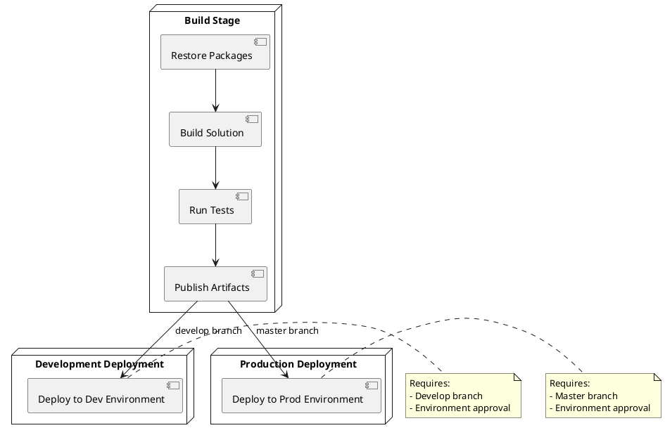

## Pipeline Flow Documentation

### Build Stage

1. **Restore Packages**: Retrieves all NuGet dependencies
2. **Build Solution**: Compiles the .NET 8.0 application
3. **Run Tests**: Executes test projects
4. **Publish Artifacts**: Creates deployment package

### Deployment Stages

1. **Development**

   - Triggers on develop branch
   - Requires environment approval
   - Deploys to dev environment

2. **Production**
   - Triggers on master branch
   - Requires environment approval
   - Deploys to production environment

### Required Resources

- Azure Subscription
- Azure Web Apps (dev & prod)
- Azure DevOps Service Connection
- Environment Approvers
