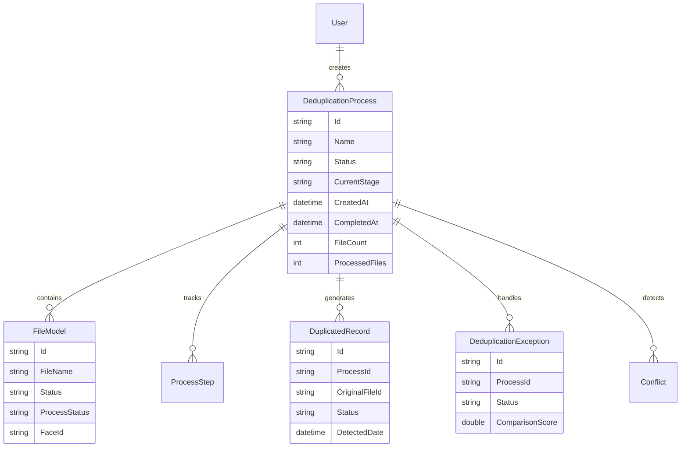
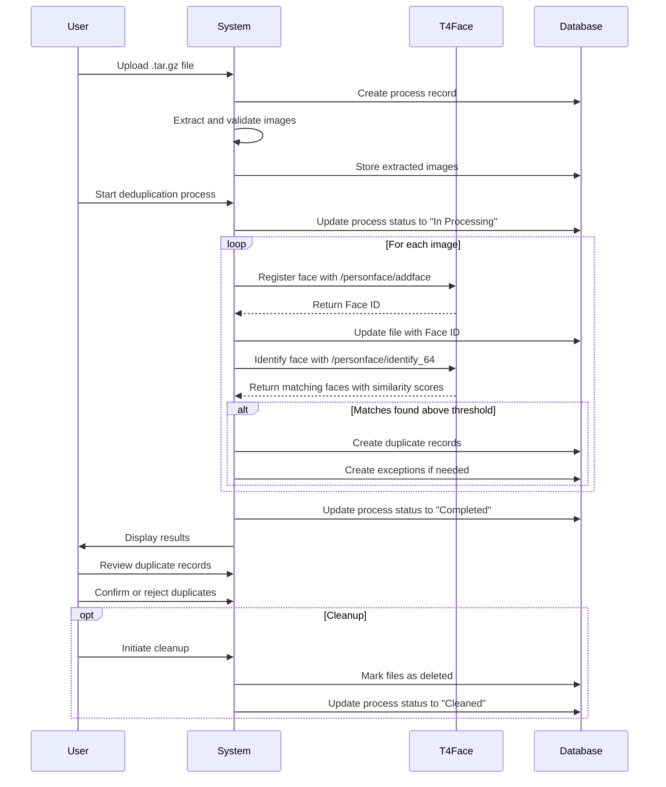

# Facial Recognition Deduplication System

## Table of Contents

1. [Project Overview](#project-overview)
2. [System Architecture](#system-architecture)
3. [Key Features](#key-features)
4. [API Documentation](#api-documentation)
5. [Technical Implementation](#technical-implementation)
6. [Security & Authentication](#security--authentication)
7. [Development Stack](#development-stack)
8. [Server Configuration](#server-configuration)
9. [Getting Started](#getting-started)
10. [Detailed Documentation](#detailed-documentation)
11. [Recent Updates](#recent-updates)

## Project Overview

This system is designed to handle biometric facial recognition and deduplication for a banking application. It provides secure access management through facial authentication while ensuring no duplicate facial records exist in the system. The platform uses advanced facial recognition technology through the T4FACE API to identify potential duplicates, which are then presented for human review and confirmation.

## System Architecture

### Components

1. **Frontend**

   - User interface for process management
   - Real-time process monitoring
   - Visual feedback for deduplication results
   - Accessible at: `http://localhost:4200`

2. **Backend**

   - Process management and execution
   - Database operations
   - Integration with T4Face biometric service
   - Business logic implementation
   - Accessible at:
     - HTTP: `http://localhost:5148`
     - HTTPS: `https://localhost:7294`
   - Swagger UI: `https://localhost:7294/swagger`

3. **Database**

   - Process tracking
   - File management
   - Exception handling
   - Conflict resolution
   - Audit logging
   - RavenDB Community: `https://a.stage.ravendb.community`

4. **T4Face Service**
   - Facial recognition engine
   - Biometric matching
   - HTTP API integration

## Key Features

### 1. Authentication & Authorization

- JWT-based authentication
- Role-based access control (User/Admin/SuperAdmin)
- Google OAuth integration
- Password reset functionality
- Session management

### 2. User Management

- User registration and validation
- Profile management
- Role assignment and management
- User confirmation process
- User deletion (SuperAdmin only)

### 3. File Upload and Processing

- Support for tar.gz archive uploads containing multiple images
- Automatic extraction and processing of images
- Base64 conversion for preview and processing
- Temporary file management with automatic cleanup
- Comprehensive process tracking and status updates

### 4. Deduplication Process

- Background processing of facial images with T4FACE API integration
- 1:N facial matching with configurable similarity threshold
- Multi-stage processing with detailed step tracking
- Duplicate record creation and management
- Exception handling for special cases
- Conflict detection and resolution
- Real-time progress tracking with detailed status updates
- Process pause/resume capabilities

### 5. Process Management

- Start/Pause/Resume operations for deduplication processes
- Process status tracking with detailed state management
- Conflict detection and resolution workflow
- Duplicate record review and decision-making (confirm/reject)
- Exception management and resolution
- Cleanup operations for completed processes
- Process history tracking with comprehensive audit trail
- Data consistency enforcement across related entities

## API Documentation

### Authentication API

- Login/Logout
- Google OAuth
- Password reset
- Token management

### User Management API

- User registration
- Profile management
- Role management
- User confirmation

### Upload API

- File upload
- Temporary file management
- Base64 conversion

### Deduplication API

- Process creation and initialization
- Process execution with multi-stage tracking
- Process control (pause/resume/cleanup)
- Status tracking and detailed reporting
- Duplicate record management
- Exception handling and resolution
- Conflict detection and resolution
- File status synchronization
- Result retrieval and analysis

## Technical Implementation

### Database Schema



### Process Flow



## Security & Authentication

### Authentication Flow

1. User registration with role assignment
2. Email validation process
3. JWT token generation
4. Role-based access control
5. Session management

### Security Features

- HTTPS enforcement
- JWT token validation
- Role-based authorization
- Secure cookie management
- Input validation
- Exception handling

## Development Stack

- **Frontend**: Angular (Port: 4200)
- **Backend**: .NET Core (Ports: 5148 HTTP, 7294 HTTPS)
- **Database**: RavenDB Community
- **CI/CD**: Azure DevOps
- **Hosting**: Azure

## Server Configuration

### Port Configuration

```json
"Server": {
  "HttpPort": 5148,
  "HttpsPort": 7294
}
```

### Access Points

1. **Backend API**

   - HTTP: `http://localhost:5148`
   - HTTPS: `https://localhost:7294`
   - Swagger UI: `https://localhost:7294/swagger`

2. **Frontend Application**

   - URL: `http://localhost:4200`

3. **Database**
   - URL: `https://a.stage.ravendb.community`

## Getting Started

### Prerequisites

- .NET Core SDK
- Node.js and npm
- RavenDB Community
- T4Face service access

### Installation

1. Clone the repository
2. Configure environment variables
3. Set up database connection
4. Install dependencies
5. Start the application

### Configuration

- Update `appsettings.json` with your settings
- Configure JWT secret key
- Set up email service credentials
- Configure database connection

### Running the Application

1. Start the backend server
2. Start the frontend application
3. Access the application through the configured URLs

## Detailed Documentation

### Core Feature Documentation

- [Authentication](Documentation/Auth.md): Comprehensive authentication and authorization system
- [User Management](Documentation/UserManagement.md): User administration and role management
- [File Upload](Documentation/Uploading.md): Secure file upload and processing system
- [Deduplication](Documentation/Deduplication.md): Facial recognition and deduplication process
- [Profile Management](Documentation/Profile.md): User profile and settings management
- [System Flow](Documentation/Flow.md): Detailed system workflows and component interactions

### Development and Deployment

- [CI/CD Pipeline](Documentation/pipeline-flow.md): Continuous integration and deployment workflow
- [API Documentation](https://localhost:7294/swagger): Interactive API documentation (Swagger)

### Additional Resources

- [Security Guidelines](Documentation/Auth.md#security-implementation): Security implementation details
- [Deployment Procedures](Documentation/pipeline-flow.md#deployment-stages): Deployment process documentation
- [Troubleshooting Guide](Documentation/Flow.md#error-handling): Error handling and troubleshooting

## Recent Updates

### Data Consistency Improvements

- Enhanced data consistency across deduplication processes and related entities
- Implemented automatic field synchronization when processes are completed
- Added proper handling of date fields (CompletedAt, StartDate, EndDate)
- Ensured file status consistency with parent process status

### Deduplication Process Enhancements

- Improved tar.gz file upload and extraction process
- Enhanced T4FACE API integration with better error handling
- Added support for process pause/resume functionality
- Implemented comprehensive exception handling and tracking
- Added detailed process step tracking

### Frontend Service Improvements

- Created dedicated services for each entity type (files, duplicate records, exceptions)
- Improved error handling with fallback strategies
- Enhanced ID normalization across all services
- Added support for all backend data fields

### Documentation Updates

- Added comprehensive [Deduplication Documentation](Documentation/Deduplication.md)
- Created visual workflow diagrams
- Updated API documentation
- Added troubleshooting guides
